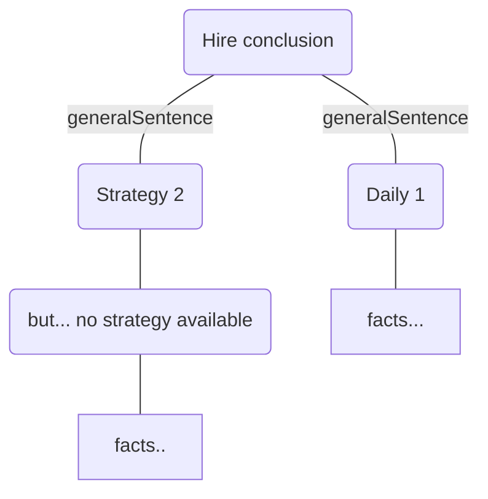
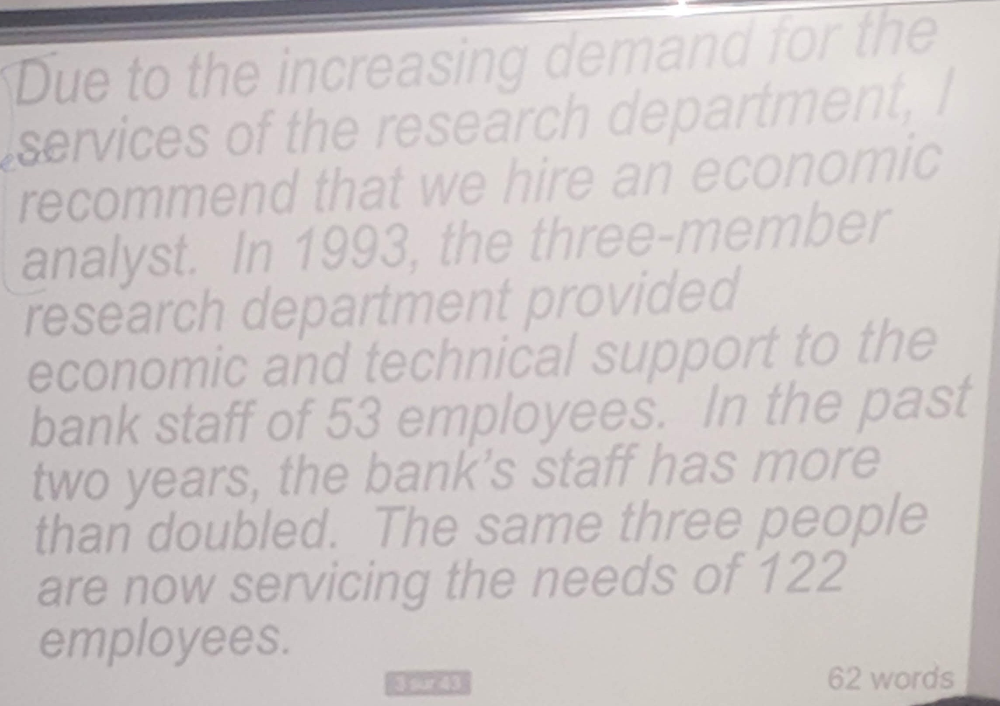
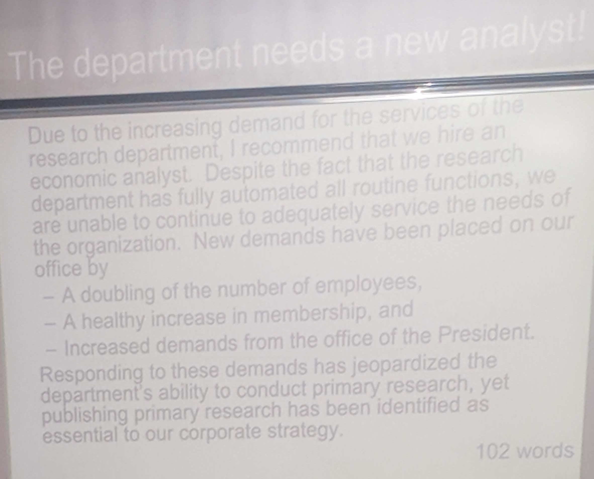

* @file day2.md
* @author Rod Guillaume
* @date 24 Sep 2018
* @copyright 2018 Rod Guillaume
* @brief anglais-marketing.com

# Exemple de messages BUWI

En gros c'est un exo ou on joue une banque qui veut recruter un economic
analyst. Faut structurer son... message?

En introduction on parle de notre **goal**, ici c'est `hire`.

> Exemple avec Dujardin a qui on veut parler.
> Ne pas commencer par 'hey, vous avez 5 minutes?'
> plutot 'hey je veux vous parler du recrutement d'un nouveau econ analyst`

Par contre commencer par "Dear CEO, you must hire an economic analyst" c'est un
peu violent. Plutot *'I recommended hiring an economic analyst'*.

> du coup on fait pas du 'you-attitude', mais comme c'est une recommandation le
> 'I' passe.

## Structure

* GOAL
  > Hire

* PURPOSE
  * Why you want to hire?
  * Attention getter.
  * Something of interest
  > Ici on pourrait dire que ca fait 2 ans que y'a de la croissance, et on est
  > arrives au max, donc si on veut continuer a grossir faut embaucher.
    > "new effort is needed", "research staff 100% busy"
    > it's needed *daily*. Strategy ca se suit tous les jours.

* daily : short term
* strategy : medium to long term

## Les infos qui interessent le CEO

* Research staff is 100% on existing demands.
  * Ca il s'en fout, il en est meme content que tous ses salaries bossent.
  * daily routine
* Healthy increase in membership for the economic dpt's production
  * ca l'interesse
* Doubling of the numbers of employees in the bank (deal with customers)
  * ca l'interesse
* Ability to conduct primary research is jeopardized
  * Ca il aime pas
* Primary research is of strategic importance
  * depends on the CEO
  * C'est du medium-long term.

## Tree of arguments

> **PARTIEL**
> Ca sera ce genre d'exo au partiel. Un tree of arguments etc.

## Les corrections

> Elles sont dispo sur le site du prof normalement.

# Exemple Adobe

> 'We need your feedback!'

Ce n'est pas *building goodwill*, this isnt *user friendly*.
Mais c'est une entreprise americaine donc c'est du *low context* (direct). Du
coup c'est plutot honest comme phrase.

Ensuite, il est *Developer Relations*. Donc faut pas etre diplomate.

* GOAL: inform, c'est une newsletter.
  * also *recommends* doing something/*taking action* (giving feedback)

Il utilise des keywords a chaque debut de paragraphe pour dire de quelle techno
on parle. ca permet de sauter directement a ce qui nous interesse.

Dans le dernier paragraphe il utilise **also** qui marque 2 parties dans le
texte.

> Pourquoi ne pas avoir mis 2 paragraphes au lieu d'en avoir fait un en deux
parties?
