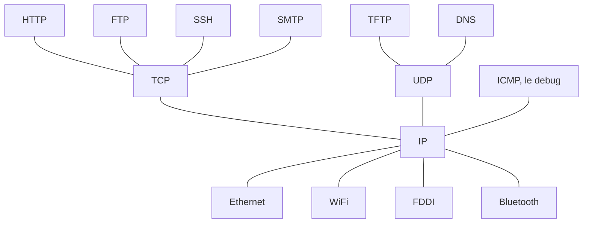

* @file cours1.md
* @author Rod Guillaume
* @date 7 Nov 2018
* @copyright 2018 Rod Guillaume
* @brief Introduction

# Bibliographie

* Computer Networks: A Systems Approach (5th edition) - Peterson
  * Partie 1
  * Networking 3
  * Networking advanced 4
* TCP/IP illustrated (Volume 1, 2nd edition) - Stevens
  * Internet machin architecture
  * Link layer sur ethernet
  * ARP mais vite fait
  * TCP osef, lis pas ca fait 6 chapitres
  * y'a IP apres

# Plan

1.  Faire un LAN
2.  Inter-connecter des LAN (internet et trouver un chemin)
    * internet
    * table de commutation
3.  garanties offertes, design pour les devs sur le reseau (comment on offre une abstraction pour les users pour pas qu'ils connaissent la technique derriere. Ils s'en fichent les devs de savoir la topologie et tout)
    * resilience
    * API

# Modele OSI

7 couches, 7 problematiques a resoudre.

> OSI on s'en sert pour la pedagogie, mais on ne s'en sert pas du tout dans la
> vraie vie.

## Couches OSI

# 1. physique

Dimension du cable, quel cable etc.

# 2. Link Layer, couche de liaison

Link = reseau local

Comment je fais un reseau local, ethernet, token ring, bluetooth, etc.

# 3. Couche network (inter-network)

Comment on interconnecte mes reseaux locaux ? Comment je trouve mon chemin dedans ?

# 4. transport

abstraction que j'offre a mon developpeur.
Resilience ou pas, etc.

# 5. Session
> historiquement, c'etait pour voir comment c'etait le workflow de comment ca se passe quand on se conecte, deconncte

# 6. Presentation

> Que tout le monde parle le meme langage (encodage, endianess, compression...?)

# 7. Application

Le dev qui utilise ses protocoles pour faire ses apps. HTTP, SMTP...
Les protocoles applicatifs quoi.

> Les 5, 6, 7 osef.

# Modele TCP/IP

TCP/IP est arrive quand y'avait deja des LAN partout. Donc il se pose pas la
question de la couche LINK, NETWORK, etc.

## 1. Couche Host Network

> Y'a un reseau local en dessous de moi et en face aussi c'est un LAN

TCP/IP ne regarde pas ce qu'il y a en dessous (le reseau local)

## 2. Couche Internet

Comme la couche 3 OSI

## 3. Couche Transport

Comme la couche 4 OSI

## 4. Applicatif

Pour les devs

# Principe d'encapsulation

Chaque couche a besoin de rajouter de la metadata sur le message de base.

Envoie de paquet on descend de la couche 7 a la couche 1. Et a chaque fois on
rajoute ses metadata.

Reception on remonte de la couche 1 a 7, et on retire/depile les metadata a
chaque fois.

# Modele jargon

* HOST NETWORK on l'appelle layer 2
* Transport network on l'appelle 3 (IP)
* TCP etc tranport c'est 4 (PORT)
* l'app c'est couche 7.

On utilise les couches du OSI mais avec les 4 couches de TCP/IP en gros.

# Commutation par circuit, par paquet

TCP et OSI ont fait un choix tous les deux: la *commutation par paquet*.

Y'a une autre technique, la *commutation par circuit*.

Avant de communiquer, j'etablie un chemin, un channel de discussion en gros.

*Commutation par circuit* en gros c'est comme le telephone a l'epoque, dans les
films genre Sunset Boulevard etc.A

## Pbs du circuit

1. Par circuit le pb c'est que ca met du temps a faire la connexion. Avec le
telephone ca allait parce que les communications etaient longues. Avec le web on
fait des connexions courtes.

2. Si y'a un noeud qui meurt ca casse tout

3. Quand je suis connecte a qqun je suis bloque avec les autres qui veulent me
parler. On peut faire qu'une seule chose a la fois donc.

## Idee de la commutation par paquet

Datagramme: on decoupe le message en plein de petit paquet, et chaque petit
paquet possede son petit header avec son numero de paquet et tout.

Du coup on peut envoyer tous les paquets dans n'importe quel chemin et le
destinataire n'a plus qu'a recoller les morceaux.

> C'est IP qui s'occupe de remettre le paquet dans l'ordre

# Digression historique

ARPANET, le premier reseau local commuté par paquet
C'est le dpt de la recherche militaire americain.
Y'avait pas besoin de OSI ou TCP vu que c'etait juste un LAN donc pas besoin
d'inter-connecter des LAN.

Ensuite y'a eu plusieurs LAN, dont Cyclade de Poujade en France etc.

> Documentaire sur l'historique de TCP/IP ou OSI: The Internet That Wasn't

OSI etait payant, TCP/IP etait gratos. Donc ARPANET a choisi TCP/IP.
Et Internet est né.

# Les protocoles

IEEE 802: groupe de travail qui s'occupe des reseaux locaux

* 802.3 = ethernet
* 802.11 = WiFi
* FDDI
* Token Ring
* Bluetooth
* ...

Tous ces protocoles passent par UN point, **IP**.

Les 5 pbs de reception d'un paquet:

1. perdu
1. corrompu
1. dupliqué
1. réordonné
1. répété

* TCP protege des 5 et d'autres chose.
* UDP protege juste de la corroption, avec un checksum. c'est tout.

Les deux protocoles introduisent la notion de **port**.
**multiplexing** = 1 tuyau, mais plusieurs fils dedans.

Le port c'est cette info qui permet de de-multiplexer justement.

### Protocoles sur TCP

Les ports des protocoles:
* ssh 22
* ftp 20 et 21
* http 80 et 8080

### UDP

TCP propose un algo pour bien reception les paquets et tout et tout.

Dans 95% du temps on utilise TCP, mais parfois on a envie d'avoir un truc custom
ou on veut utiliser notre algo car on sait qu'il fonctionnera mieux.

* TFTP
* DNS port 53
  * DNS c'est tellement petit que ca tient dans UN paquet donc osef de TCP
* Tunneling
  * Quand on recoit du TCP et on le transmet pour UDP vu que y'a deja du TCP
    dedans

### ICMP

Protocole de debug et de diagnostique.

> Port de ping? Y'en a pas car ca passe pas par TCP ou UDP.
> C'est un protocole de debug et de diagnostique

La notion de port est apparue avec TCP et UDP.

# End to End

L'intelligence de TCP/IP, c'est uniquement sur les deux extremites
(emetteur/recepteur).

Tous les elements du milieu c'est juste pour transmettre.

Donc le but normalement c'est d'avoir 0 state (0 truc a se souvenir) dans les
couhces intermediaires.

# XCast

**Unicast**: quand on parle a UNE personne
**Broadcast**: quand je parle a tout le monde
**Multicast**: quand je parle a un groupe de personnes abonnes.

* TCP = Unicast
* UDP = Multi et Broad

TCP c'est forcement UNE session avec qqun.

# Prochains cours

* Ethernet, comment marche un reseau local. Switch, VLAN etc.
* IP, logique derriere les @IP etc.
  * routage
  * attribution des @
* TCP, UDP
* Les grands protocoles applicatifs
  * HTTP
  * DHCP
  * DNS
