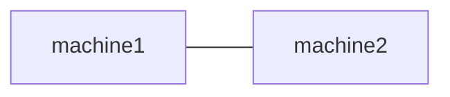
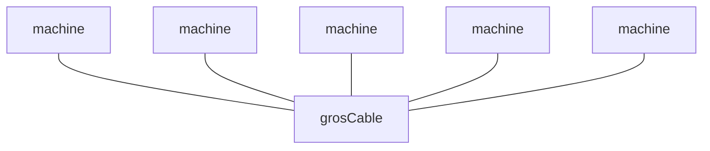
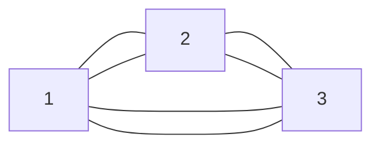
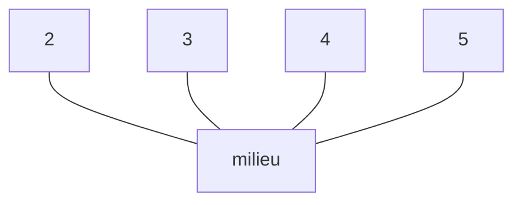
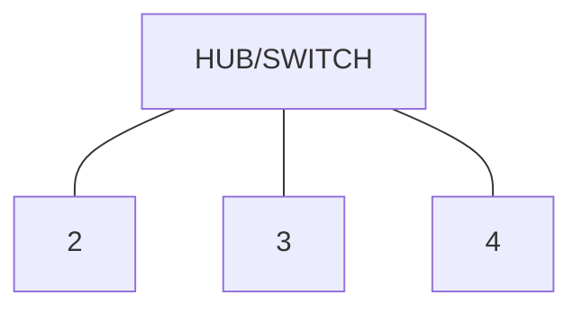

* @file cours2.md
* @author Rod Guillaume
* @date 14 Nov 2018
* @copyright 2018 Rod Guillaume
* @brief
* @contact https://kevinsztern.fr/internet/

# Previously

* Modele OSI
* Modele TCP/IP
* Encapsulation
  * du haut vers le bas quand on send
  * du bas vers le haut quand on receive
  * Chaque niveau rajoute ses metadata pour aider la coucher d'apres

# Reseau Local

## Topologie

Comment j'ai agence mon reseau local, comment les machines communiquent entre
elles?

### Point a Point



On le retrouve dans les vieux trucs, ou t'as ta machine et ton roueur. done.

### Topologie en Bus

Un grand cable (coaxial).
Les machines sont toutes connectees sur le meme cable.



Ethernet, avant d'etre avec des switchs et tout, avant c'etait en bus.

"ether", c'etait en bus car tout est connecte au bus (comme l'ether en
spiritualite).

### Topologie en anneau

protocole lie: token ring



Bon c'est mal dessiné mais t'as les machines à la suite les unes des autres.
C'est pas en étoile.

### En mesh

Tout est connecte a tout.

### En etoile



Elles sont toutes autour du truc. C'est pas comme mon dessin de bus.

# Domaine de broadcast

domaine de broadcast = ensemble de machines qui ont recu un broadcast quand j'en
ai envoye un.

Un reseau local c'est donc tout betement toutes les machines qui recoient le
broadcast quand j'en envoie un.

Un LAN est donc **defini** par son *domaine de broadcast*.

# Domaine de collision

Tous les endroits ou il peut y avoir un pb de collision.

**Domaine de collision**: endroit ou on peut pas parler en meme temps, sinon
message corrompu.

> Ex. avec topologie en bus.
> Tous sur le meme cable. Donc si on envoie un truc sur le reseau, tout le monde
> le voit passer.
> Si deux personnes en meme temps parlent sur le reseau, ca marche plus. On peut
> pas parler en meme temps sur le meme domaine de collision.

Le but ca va etre de reduire le domaine de collision.

Le pire cas etant la topologie en bus: domaine de broadcast = domaine de
collsion x)

# Types de flux sur un medium

## Simplex

Liaison qui va dans UN seul sens.

> Ex. La TV. On recoit mais on envoie pas.
> Ex. La radio

## Half Duplex

On peut faire un seul truc a la fois, mais pas en meme temps.

> Ex. Walkie-Talkie
> Ex. La voix, sinon on s'entend pas

## Full Duplex

Dans les deux sens, et les deux en meme temps.
C'est 2 simplex en gros.

# Controler l'acces au medium

Pour eviter les collisions, il faut donc reguler le temps de parole.

> Media Access Control, ca vient de la MAC.

# Protocole ethernet

Avant c'etait sur du bus (ether tout ca).

Ensuite il a eu l'idee de dire:

> Je parle. Si quelqu'un d'autre parle, je me tais, j'attends un peu et je
> recommence.

Eh bah ca a eu des perfs de malade cette idee.

Donc pour faire son protocole la, il nous faudrait:

* Carrier Sense
  * Le truc qui ecoute sur le medium si qqun parle
* Multiple Access
  * Bah y'a plusieurs machines sur le reseau, logique...
* Collision Detection
  * Quand je parle, j'utilise le carrier sense pour voir si y'a une collision ou
  * pas.

Ca vient de la **CSMA/CD**: "Carrier Sense Multiple Access with Collision
Detection".

# CSMA/CD

1. Je veux envoyer un message.
1. J'ecoute le carrier sense.
1. Si qqun parle, j'attends
1. Si c'est bon, j'envoie tout en verifiant que ce que j'envoie n'est pas
altéré.
1. Si c'est diffrent, y'a donc une collision donc la detection de collision dit
a tout le reseau de pas prendre en compte ce qu'il vient de se dire. (on "jam")

Le secret pour pas que ce soit le bordel. On donne un temps d'attente *random* a
chaque machine. Comme ca si y'a collision bah les machines recommencent pas a
parler a chaque collision.

Pour le *layer 2*, y'a une entite en plus de IETF, c'est un groupe de travail du
IEEE (Institute of Electrical Elecronic Engineers).

# ADSL, Paire torsadée

A la base Ethernet c'etait sur du coaxial, mais les entreprises avaient la
flemme de changer de cablage donc ethernet a change pour etre utilise sur le
reseau telephonique (Twisted Pair) donc ca a ete appele EoTP (Ethernet over
Twisted Pair).

8p8c (8 pates, 8 connectors) et pas RJ45, mais tout le monde appelle ca RJ45.

# Switch

Avant les switch, y'avait des *hub*.

Hub = switch en moins bien. Maintenant c'est full switch. C'est juste un hub en
mieux et plus intelligent.

# Trame ethernet

Y'en a plus en vrai, mais dans la vraie vie on voit que 3 champs:

* MAC source
* MAC destination
* EtherType
  * "c'est quoi qu'il y a plus haut?"

> Rq. Dans chaque en tete, y'a un champ pour dire le type du prochain header.

Tous les gens branchés sur un switch sont sur le meme domaine de broadcast.



Le HUB quand il recoit un message, il envoie a *tout le monde*.

## Probleme du hub

* securite ?
  * bon suffit de foutre les gens sur le meme hub quand y'a des pb de securite.
* collision a balle

## Vers le switch

Lui, il regarde le mac de destination. et il envoie *a la bonne personne*.

Comment il sait qui est quelle adresse mac?

La premiere fois il broadcast.
Mais il apprend l'adresse mac de la source. Il sait que tel port (port physique), c'est l'adresse mac X.
Au fur et a mesure, il apprend qui est qui.

> Donc pour resumer, au debut il broadcast, et quand il connait les adresses MAC
> des gens, il broadcast plus.

*Forward Information Base* (base des informations de forwarding)

FIB c'est son "cache" des adresses MAC---port.

La FIB peut avoir plusieurs MAC associe a un port. Ca permet de connecter
plusieurs switchs entre eux pour eteindre le LAN.


Tempete de broadcast: quand tu connectes plusieurs switch entre deux. Bah si tu
broadcast ils vont se broadcast dans la tete a l'infini vu que ca fait une
boucle. (*Broadcast Storm*)

## Protocole STP

Y'a un *protocole qui existe pour ce probleme*: **STP** (*Spanning Tree
Protocol*).

Du coup les switch parlent entre eux, et ensemble ils construisent une vision
globale du reseau.

# VLAN

Un switch c'est 15000€, on va pas claquer 15k pour chaque reseau local. Du coup
on va creer des VLAN.

On peut configurer les ports (physiques, les trous) de deux facons.

## Access Port

* Tous les gens avec le meme access port ont l'impresion d'etre dans le meme
  reseau local.
* Du coup on dit 'tel port c'est telle VLAN etc.'

La configuration Access Control est fait **au niveau du switch**. Les machines
**n'ont pas conscience d'etre dans un VLAN**.

## Trunk Port

Ils ne sont pas utilises pour connecter des machines (c'est access pour les
machines).

C'est pour inter-connecter 2 switchs pour qu'ils utilisent la meme politique.

C'est pour rendre invisible le fait qu'on a connecter deux switchs.

Ca agrandit la trame ce truc. Ca rajoute un header `802.1Q`. (cf. le site du
prof)

Dans le header `802.1Q`, y'a un `VID` (vlan id).

> Le header 802.1Q se trouve a la place du truc EtherType (a la place, mais il
> la remplace pas. Le truc ethertype est juste apres) donc si il voit le header
> au lieu du ethertype c'est qu'on est en trame etendue.

On resume. Les trunk c'est pour connecter les switchs entre eux, avec le fameux
header en plus. Ce header est rajoute au niveau des switchs, et ils les retirent
ensuite donc pour les machines c'est invisible.

> Switch c'est layer 2 apparemment.

Dans les switch trunkés ensemble, tu peux évidemment dire quels ports tu veux et
tout pour pas forcément entendre TOUT le reseau de l'autre switch.

> Dans l'admin, on choisit donc Access ou Trunk. si c'est Access on dit pour
> quel VLAN ID, et si c'est trunks on dit les VLAN**s**.

> Trunk c'est un terme Cisco, mais tlm utilise les termes cisco

> Recommendation: https://www.gns3.com/ pour s'entrainer en reseau

# Reseau en command line

```bash
ip link # montre les adresses MAC
```

> 1 adresse MAC par carte reseau dans le monde.

# CCL

* TCP/IP zoomé sur LAN

* I3E 802.3 ou .11 est l'entite qui regule tous les trucs de LAN.

* Domaine de collision
* Domaine de broadcast

* Ethernet topologie en bus a la base avec CSMA/CD.
* Ca a eu du succes, mais il s'est transforme en TP au lieu de coaxial pour etre
  utilise.
* Adresse MAC.
* Topologie en etoile sur HUB/Switch.
* Switch = hub avec FIB, donc plus intelligent.
* Trunk/Access

> Avec le switch, maintenant le domaine de collision, c'est juste entre la
> machine et le switch.
> Maintenant c'est carrement sans domaine de collsion car full duplex entre
> switch et machine.

* Danger de connecter 2 switchs en meme temps car risque de broadcast storm.
  * On active donc STP
  * On utilise des VLAN pour decouper un switch pour donner l'impression d'avoir
    plusieurs switchs.

Quand on a plusieurs reseaux locaux, faudra passer en couche 3 et regarder les
@IP.
