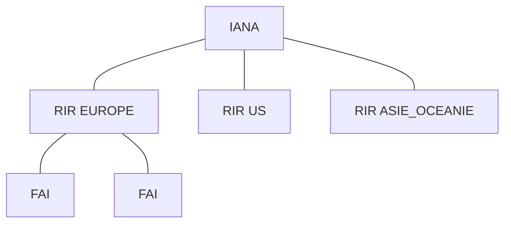

* @file cours3.md
* @author Rod Guillaume
* @date 21 Nov 2018
* @copyright 2018 Rod Guillaume
* @brief <brief>

# Previously

On a vu la couche 2 (commutation).

Rappel des couches:

2. host network (LINK) (host network c'est un melange couche 1/2 en TCP/IP)
3. internet (network)
4. transport
7. application

lien/link/segment = reseau local

On a vu un protocole de layer 2, ethernet.

On a vu son histoire avec son depart avec un bus, maintenant c'est en etoile
avec CSMA/CD. Domaine de collision restreint a la liaison entre switch et
machine.

Domaine broadcast et domaine de collision.

VLAN (simulation de plusieurs reseaux au sein d'un meme reseau.) Le tout avec
les ports access et trunks.

Access/Trunk <=> Tagged/Untagged

A/T c'est la terminologie Cisco.
Tagged/Untagged c'est la terminologie normale.

Trunk = entre deux switchs.

La difference entre access et trunk, c'est surtout qu'on retire le tag quand
c'est access, et trunk ils laissent les tags (headers).

untagged = access (on retire le tag)
tagged = trunk (on laisse passer le tag)

# GN3S

`iproot2` ou `iproute2` je sais pas.

```bash
ip -c # color

# donner des @ip a des machines
ip  addr add 192.168.1.1/24 dev eth0
ip  addr add 192.168.1.2/24 dev eth0

# set les ports access/trunk
ovs-vsctl set port eth0 tag=42 # switch 1
ovs-vsctl set port eth0 tag=42 # switch 2
# par defaut tous les ports sont trunk donc pas besoin de mettre trunk entre les
# deux switchs.

# activer le ptocole STP pour eviter les boucles de broadcast
ovs-vsctl set bridge br0 stp_enable=true
```

# IP

On a plusieurs LAN (ou VLAN), et on peut les **interconnecter**. Pour ca on
utilise IP.

A son creation, fallait interconnecter des protocoles differents, vu que
c'etait pas que du ethernet partout.

Le pb a l'epoque on pouvait pas se baser sur les @ layer 2 (genre MAC), vu que
c'etait pas du ethernet partout.

Du coup on a une @MAC (local) et une @IP (interconnexion).

> Toutes les @ unicast (un destinataire), sont toujours decoupees en deux.
prefix, suffix.

Le prefixe est commun a toutes les machines sur un meme reseau local.
Si on est pas sur le meme reseau local, on a pas le meme prefixe.

> Les classes d'@IP et tout c'est obsolete. Le decoupage etait trop violent,
> c'etait 8, 16 ou 24 bits pour la taille du prefixe.

Maintenant on utilise le CDR? (truc du genre), en gros tu specifies le nb de
bits dans le prefixe.

`192.102.1.2/24`

On a aussi le masque de sous reseau, donc ici ca serait `255.255.255.0`.

> Donc @IP c'est coupe en 2 et on donne toujours la decoupe via le / ou via un
> masque.



IANA = il donne des /8, donc 255 a donner
RIR = des IANA regionaux en gros
Apres y'a des FAI tier 1, puis les autres moins importants...

# Router (anciennement gateway)

C'est une machine sur plusieurs LAN. Il a 2 cartes ethernet. Donc 2 @MAC et 2
@IP.

Il a une MAC par LAN et une @IP dans chaque LAN.

Les routers souvent on donne le numero 1 ou le plus haut numero de machine
possible. (ici 254)

Quand on envoie un message IP, on y va petit pas par petit pas, de router en
router. Ils utilisent les prefixes pour savoir vers quel router aller. (hop par
hop).

Du coup pour communiquer vers l'exterieur:

1. On set la route vers l'exterieur
1. On envoie la trame
1. elle va d'abord au routeur
1. le routeur renvoie une autre trame (la meme, il redirige) vers l'autre
  machine

Y'a donc 2 paquets d'envoyes.

# Exemple d'envoie de trame entre deux LAN

Imaginons 2 machines sur 2 LAN, avec un routeur entre les deux:

Paquet 1:

MAC SRC = machine 1
MAC DST = routeur (carte reseau 1)

IP SRC = 42.1 (c'est son VLAN et son num de machine)
IP DST = celui de l'autre machine, pas du routeur !!!! 51.1

Paquet 2:

MAC SRC : roueur (carte reseau 2, donc pas la meme)
MAC DST: @ de l'autre machine

IP SRC: 42.1
IP DST: 52.1

> Le switch c'est layer 2. Il regarde pas l'@IP. Il regarde que l'@ mac.

Par contre, la premiere machine comment elle connait l'@ mac du routeur? Elle
connait que son @IP. Mais pour envoyer le paquet il faut l'@ mac. Pour ca on
utilise ARP.

Le modele TCP/IP a invente un autre protocole pour resoudre ce pb. (retrouver
@mac a partir de l'@ip)

C'est l'ARP (Address Resolution Protocol)

# ARP (Address Resolution Protocol)

Communiquer localement a une @MAC, mais nous on config le reseau en @IP donc on
a besoin de retrouver les @MAC des gens.

Ca permet de retrouver les @mac a partir des ip.

## Principe du Protocole ARP

- "hey, c'est qui qui a cette @ip?" (en broadcast)
- "hey, c'est moi !" (reponse locale, il a pas besoin de gueuler)


Comme ca tu recuperes l'@mac de la personne.

`ip neigh` pour voir le cache ARP
`ip neigh flush all` pour vider le cache ARP

# Router on a stick

Router en trunk au switch, avec 2 machines sur 2 VLAN differents.

Pour se parler ils doivent donc router.
