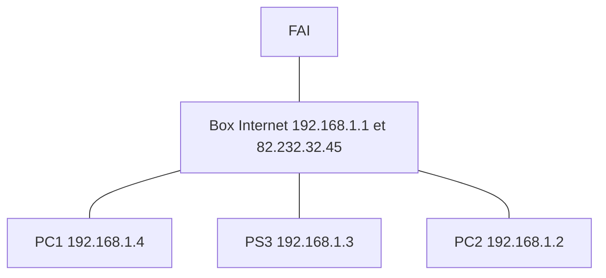

* @file cours4.md
* @author Rod Guillaume
* @date 28 Nov 2018
* @copyright 2018 Rod Guillaume
* @brief <brief>

# Previously

Bridge = switch (layer 2)
Routeur = Gateway (layer 3)

Le layer 3 c'est une problematique de routage.

Pour nous aider a faire le routage, on s'aide du fait que les @IP sont toujours
decoupees en deux. Prefixe et suffixe.

Avant y'avait pas besoin de preciser la separation vu que y'avait des classes
mais maintenant on s'en sert plus du tout donc on precise le `/n`

Pour ce faire, on utilise soit un masque `255.255.255.0` ou un `/24` (notation
CIDR).

Ensuite on a vu ARP pour retrouver les @MAC a partir des @IP

# Trame IP

TTL = Time To Live. On drop le paquet quand il met trop de temps a etre envoyé.
Avant c'etait en secondes, maintenant c'est en nombre de routeurs intermediaires.

C'est la *hop limit* en IPv4.
On decremente a chaque passage de routeur.

Maximum Transmission Unit = MTU
Chaque protocole layer 2 a une MTU a cause de contraintes physiques. Ethernet
c'est 1500 par exemple.

On retrouve donc un champ `fragment offset`. Et IP doit fragmenter les paquets
qu'il envoie au layer 2. Dans le flags y'a un flag qui dit "je suis le dernier
de la liste".

Dans la vraie vie on veut eviter de mettre de l'intelligence au milieu, dans les
intermediaires. Donc on evite de laisser IP fragmenter les paquets. On lui donne
des paquets jusqu'a trouver la bonne taille avec le flag dont fragment.

> Path MTU discovery (PMTUd) est une technique permettant de déterminer, dans un
> réseau informatique, la taille du MTU sur le chemin entre deux hôtes IP, afin
> d'éviter la fragmentation des paquets. Il est défini pour ICMP par le RFC
> 11911 et pour ICMPv6 par la RFC 82012.

> En gros IP il envoie des prepaquets pour trouver la MTU parfaite

IPv6 c'est dispo en extension mais on evite de fragmenter.

# UDP TCP en vite fait

UDP = absence de design
Petit frere de TCP et on retire toute l'intelligence

src port, dst port, length, checksum et c'est tout

## Les ports?

Pour faire tourner plusieurs apps en meme temps. Du multiplexing.

## Firewall

Routeur qui a le droit de drop. Il regarde, et il filtre selon le port dst ou
src, etc.

Le firewall de Linux: Package Filter (`pf`).
Son front-end s'appelle `iptables`.

iptables (son filtre) c'est une serie de hooks placés dans la chaine de
traitement du paquet du noyau linux.

A ces hooks, iptable y met des filtres.

Quand on manipule `iptable`, on doit justement placer nos filtres a tels
checkpoints. Donc faut connaitre le chemin que fait un paquet linux.

Il a 4 tables differentes (donc 4 collections de checkpoints):

1. table filter
  Ce sont des checks qui disent "tu passes ou tu passes pas" (binaire)
1. table NAT
  son role c'est de modifier des paquets
1. table mangle
1. table raw

Les deux dernieres on s'en sert moins souvent. osef d'elle.

> Ex. checkpoint de forward
> input, output...

> Attention par contre avec *loop back* (localhost) a un raccourci dans le
> chemin donc parfois quand tu set tes checkpoints bah il en saute certains.

## Schema iptables processing flowchart

Table filter possede 3 chaines:

1. Je recois un paquet et il m'est destine. (INPUT)
1. J'envoie un paquet. (OUTPUT)
1. Je suis un routeur, j'ai recu un paquet d'un autre et j'envoie a un autre.
(FORWARD)

```bash
# -A = append
# -p = protocol
# -j c'est pour jump REJECT ou DROP ou ACCEPT
sudo iptables -A INPUT -p tcp --destination-port 8080 -j REJECT
# -D = delete
sudo iptables -D INPUT -p tcp --destination-port 8080 -j REJECT
```

# NAT

Quand notre FAI nous file une Box, on a qu'une seule @IP.
Sauf qu'on a plusieurs machines donc on a besoin de plusieurs @.

RFC1918 = decide que y'a 3 adresses reservees, privées.

Donc la RFC propose 3 subnets prives, qui n'existent pas sur Internet.
* `10/8`
* `192.168/16`
* `172.16/12`

Tous ces prefixes, j'ai la garantie qu'ils n'existent pas sur internet, donc je
peux les utiliser comme subnets chez moi je suis sur que ca va pas poser pb avec
les autres reseaux d'Internet.



Donc en gros le routeur remplace l'@IP source quand un PC envoie un paquet, et
se souvient de son @IP du subnet via son port.

Il a une table qui dit tel port c'est tel machine.

## Protcoles STUN et TURN

En gros pour passer a travers NAT, tu creer un serveur intermediaire. Comme ca
les gens se parlent avec les @IP normales.

## Les chaines en NAT

Postrouting: SNAT (source NAT)
Prerouting: DNAT (destination NAT aka "port forwarding, donc vers qui j'envoie
ce qu'on m'envoie de dehors?")

```
# regarde la table de nat
sudo iptables -L -t nat
```
MASQUERADE = SNAT + des trucs en plus donc c'est mieux
