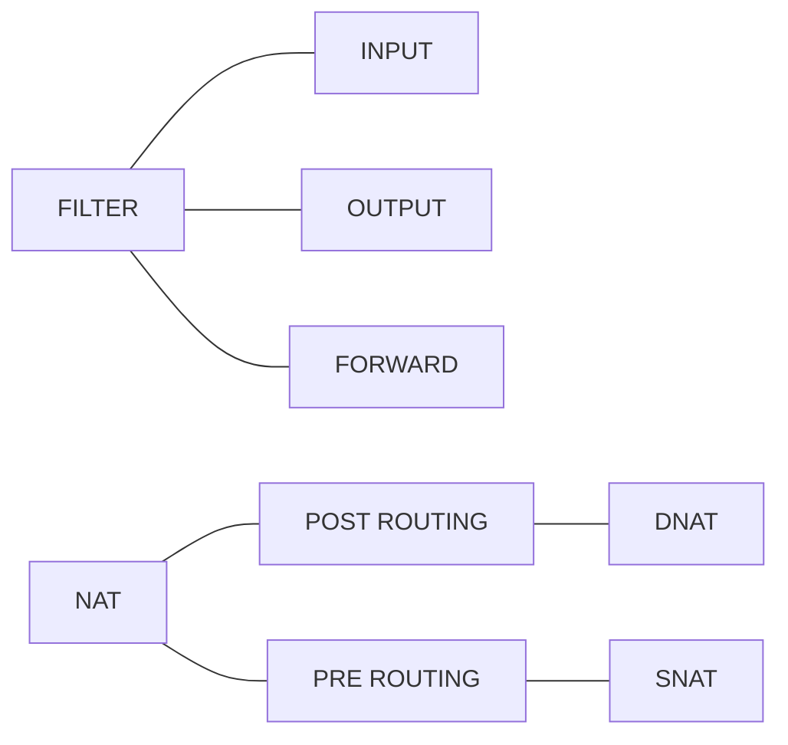
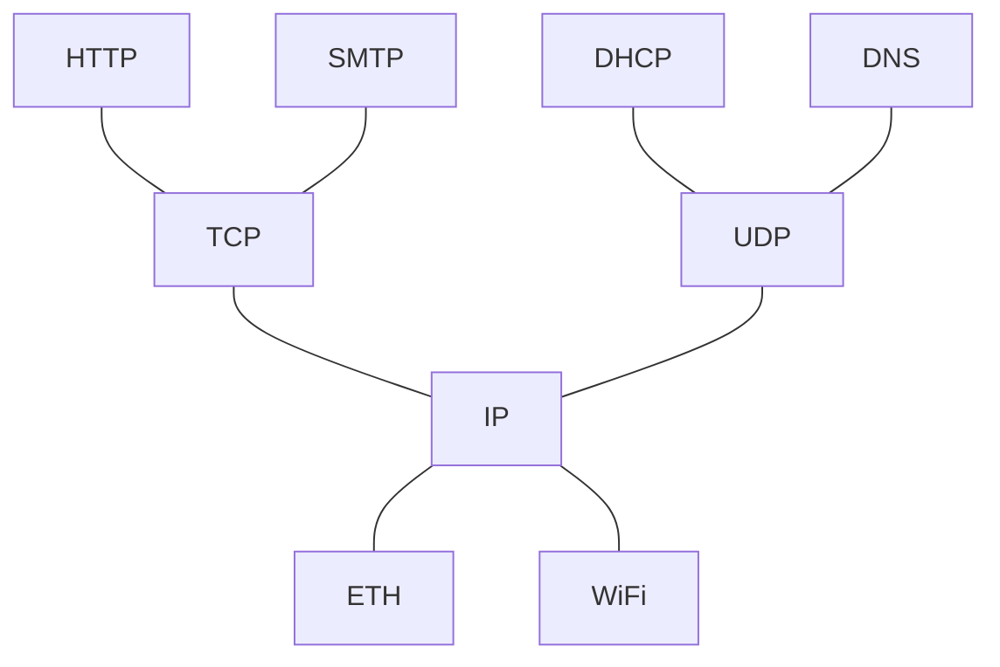
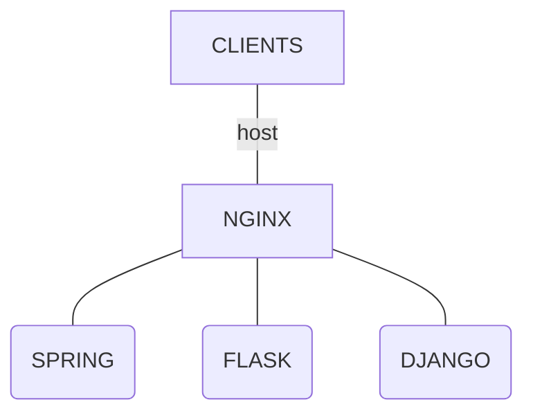
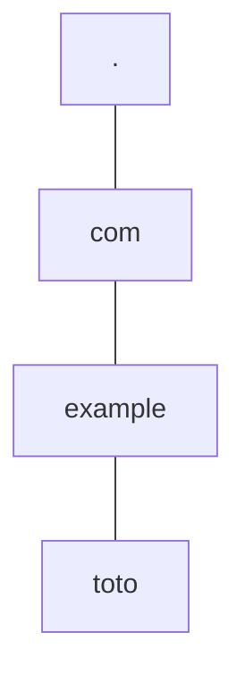

<!--
* @file cours5.md
* @author Rod Guillaume
* @date 12 Dec 2018
* @copyright 2018 Rod Guillaume
* @brief <brief>
-->

# Previously

* `iptables`



# TCP/UDP

Couche 4 : couche transport

> Rappel des couches:



# Trame UDP

* Source port
* Dest port
* Checksum

# Problemes possibles de paquets

* Lost
* Corrupted
* Reordered
* Duplicated

# Roles de UDP

UDP ne protege que contre la corruption.


# Roles de TCP

TCP gere les 4, et plus encore.

Il gere aussi le **flow control**: il gere la vitesse a laquelle on parle pour
pas noyer les autres.

> Ex. tu parles a une machine lente, faut y aller molo pour que le recepteur
> puisse dire "ralentis stp"


Il fait aussi du **congestion control**.

flow = 1 seul interlocuteur

congestion = verifier si on met pas le bazar sur le reseau en essayant de parler
a mon interlocuteur. Donc verifier que les routeurs ont pas du mal a gerer tous
les paquets qu'on envoie pour les soulager

# Roles des ports (rappel)

Ils permettent de faire du multiplexing: plusieurs apps sur une meme machine.

# Bilan UDP/TCP

## UDP

1. Un petit peu de **reliability** avec le checksum (corruption)
1. Multiplexing (ports)

## TCP

1. Reliability (les 4 points)
1. Flow control
1. Congestion control
1. Multiplexing

Du coup UDP on s'en sert quand on veut faire un truc simple qui a pas besoin de
tout ces trucs en plus.

Genre tu sais que t'envoies 1 requete seulement au gars, tu t'en fiche qu'il
fasse tous ses trucs de congestions et tout.

Ou alors si tu veux un truc mega custom, tu prends UDP et tu construis par
dessus.

# Handshake

1. client envoie message avec flag `SYN`(chronisation) au serveur (disons 42)
1. Serveur repond au client avec son numero d'`ACK`(nowlegment) (donc 43, c'est
SYN + 1, le prochain) et son `SYN` (disons 51)
1. client renvoie un `ACK` a 52
1. Serveur envoie 43 + 100
1. Client renvoie un `ACK` de 144

> Donc en resume ca donne:

1. Client `SYN = 42`
1. Serveur `SYN = 51` `ACK = 43`
1. Client `ACK = 52`
1. Serveur `43 + 100`
1. Client `ACK = 144`

En gros pour faire simple: y'a 2 sequence numbers qui avancent en meme temps. A
chaque fois tu renvoies ton Ack qui est la sequence ou t'en es, et ca augmente a
cahque fois des deux cotes: client et serveur.

> Bon c'est pas ultra clair. Le plus simple c'est que t'ouvres un wireshark et que
tu fasses un `curl google.com`. Comme ca tu peux derouler les trames TCP et voir
tous ces Ack et Syn et Seq.

# UDP -> DHCP

* Source = 0.0.0.0
* Dest = 0.0.0.0

On appelle ca une trame *discover* pour trouver le serveur DHCP (en broadcast)

Ensuite on recoit des *offers*

On choisit le DHCP qu'on veut : etape *Request*

Puis on recoit un *Acknowledgment*

On appelle ca `DORA`.

La premiere etape est en broadcast, les autres etapes sont en unicast.

# DHCP

Sur wireshark ca s'appele `bootp`, pas DHCP. C'est son ancien nom.

# Rappel sur Routeur, rien  a voir

Quand t'as un routeur, ca te donne le nb de LAN.

Le routeur c'est l'interface entre tous les LAN.

DOnc si au partiel ou je sais pas ou il demande cb y'a de LAN le plus simple
c'est d'aller voir le routeur. Voir cb il a de liaisons.

# Retour sur DHCP

Dynamic Host Configuration Protocole

DHCP c'est un protocole de Configuration

Tu demandes via DHCP ton @IP

En plus de ca, DHCP peut te donner d'autres infos comme le DNS et la Gateway.
Ces infos en plus ca se fait dans le fichier de conf

`vim /etc/dhcp/dhcpd.conf` pour edit la conf du serveur DHCP

> Dans subnet y'a l'option `option routeurs 10.0.24.1` et des `options`

```sh
subnet {
  option truc machin
  option routeurs 10.2.2.2
}
```

# Rappel setup NAT

```sh
ipables -L -tnat
# ajoute moi une entree dans la chaine post routing (append)
# on filtre sur le subnet 10.0.2/24
# et on JUMP sur MASQUERADE
iptables -tnat -A POSTROUTING --src 10.0.2/24 -j MASQUERADE
```
# HTTP

## Verbes

* GET
* POST
* DELETE
* PUT

```
VERBE RESOURCE VERSION
HEADERS
SAUT DE LIGNE

GET /toto HTTP/1.1
HOST

```

Le saut de ligne c'est pour dire "j'ai fini".

## Classes des codes de statut

* `100` info
* `200` succes
* `300` redirection > ex http vers https, ou / vers /index.html
* `400` erreur, faute du client
* `500` erreur, faute du serveur

## Reponse HTTP

```
VERSION NUM NUM_STRING
HEADERS

BODY (content-length dans le header pour donner la taille)
```
```
HTTP/1.1 200 OK
```

## Simuler une requete HTTP

```sh
# netcat
nc google.com

GET / HTTP/1.1
Host: google.com

```

## Le header HOST

`Host` est un header obligatoire.
Sur un serveur y'a parfois plusieurs sites qui tournent.

Ca permet de savoir quel site on voulait GET vu que notre requete apres DNS elle
s'appelle plus "google.com" mais 8.8.8.8 ou je sais pas quoi.

## NGINX

NGINX c'est un proxy a l'envers qui redistribue en fonction du host.



> [Rien a voir mais apparemment GUnicorn c'est bien avec Flask](https://www.digitalocean.com/community/tutorials/how-to-serve-flask-applications-with-gunicorn-and-nginx-on-ubuntu-14-04)

REST = REpresentation State Transfer

> Rappel PUT vs POST

POST = serveur qui decide de la nouvelle resource (ou elle est placee)
PUT = client qui decide de son nouvel emplacement

# DNS

DNS c'est un annuaire hierarchise, delegue et decentralise.


`toto.example.com`



Top Level Domain = TLD

Implementation de reference de DNS c'est BIND9 de ISC, comme DHCP.

Ensuite y'a des resources, les RR.

*Notion de zone*: toutes les @ au sein de `example`, c'est complete par la zone.

Donc genre toto c'est remplace par `toto.example.com.`

**NS** = delegation

**SOA**: Start Of Authority (ici example)

```sql
# Exemple de fichier de zone

$TTL 3600
$ORIGIN deliciousmuffins.net.

; IN = INTERNET
; @ = ORIGIN = google.com par exemple
@ IN SOA ns1.deliciousnuffins.net.

@ IN NS ns1 ;ns1.deliciousmuffins.net vu qu'on a pas fini par .
@ IN NS ns2

; ' CNAME pour rappel c'est pour dire que c'est un alias
pop 18000 IN CNAME agent.gandi.net
```

Dans `named.conf` c'est la que tu donnes tes zones pour dire telle adresse c'est
`type master \ file /etc/bind/db.monsite.fr`

## Types de serveur (autoritatif ou non)

autoritatif il fera plusieurs des request DNS iterative pour pas se taper les
recursives.

Les autres serveurs sont des recursifs qui vont chercher pour toi, donc genre
ton routeur de FAI.

## Exemple DNS recursif

1. Client demande a 8.8.8.8 (dns de google) une resolution de `hello.world.fr`
2. Il sait pas, donc il repart de tout en haut de la hierarchie
3. On demande aux DNS `.`, connais-tu `helloworldfr?`
4. Non, mais je connais `fr.`
5. Hey `fr.`, tu connais `hello.world.fr.`?
6. Non mais je connais `world.fr.`
7. ...

Donc en gros le recursif il fait tout ce boulot pour toi. Il demande a chaque
DNS, et il descend la hierarchie.

Si c'etait autoritatif c'est juste "Non je connais pas."

S'ils sont gentils a la limite ils te donnent un indice du gere "Non mais vas
voir la bas"

[Meilleur doc pour le DNS](zytrax.com/books/dns/)

# Conf son DNS

```
; named.conf
zone "poney.fr" {
  type "master" ;autoritatif
  file "/etc/bind/db.poney.fr" ; fichier de zone
};
```

```dns
; db.poney.fr
$TTL 3600
$ORIGIN poney.fr

; @ = origin, IN = Internet, Resource = SOA
@ IN SOA ns1 root (
    2018121201 ; YYYYMMDDxx serial
    604800
    86400
    2419200
    604800 )

@ IN NS ns1
ns1 IN A 10.254.42.100
truc IN A 42.42.42.42
```

A chaque modification du fichier de zone, on doit **augmenter le serial** !!!

Astuce: `named -g` print les logs

`dig @localhost truc.poney.fr` -> ca repond 42.42.42.42
`dig @localhost machin.poney.fr` -> ca repond not found

`/etc/dhcp/dhcpd.conf` le fichier de conf de dhcp ou tu peux set le dns et tout
