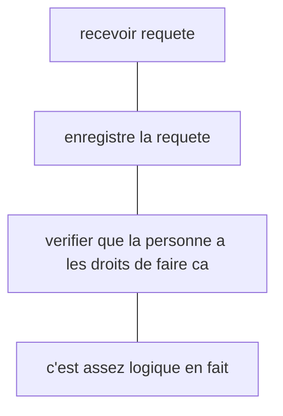

* @file cours4.md
* @author Rod Guillaume
* @date 31 May 2018
* @copyright 2018 Rod Guillaume
* @brief Les requetes

# Previously

la gestion des incidents, problemes...

# Digression

Rien a voir avec le cours je pense, mais:

**Valeur comptable d'un PC**: il perd 1/3 de sa valeur par an. Donc dans nos
comptes on marque qu'il nous a coute 1/3 du prix. Donc au bout de 3 ans on l'a
amorti/paye.

Donc duree de vie d'un pc dans une entreprise = 3-4 ans.
Tous les ans je change 1/4 de mon parc informatique.

**Total Cost of Ownership**: combien coute reellement pour l'entreprise un objet.

> Genre installation PC, prix du PC, maintenance du PC, logiciels etc.
> Y'a pas que le cout du PC. C'est souvent le cout du PC initial $\times$ 3

# Request fulfillment

On donne aux utilisateurs, employes un catalogue de services standards.

> Si c'est pas standard, on appelle ca un **changement** et on le traite
> autrement.

> On separe incident/probleme et requete/changement en ITIL.

## Differents types de requetes (les concepts de requete)

Dans une grosse entreprise y'a pas un catalogue gigantesque. Sinon on s'en sort
pas.

> Natixis, 15k employees, 200 entrees dans le catalogue.

## Self Help, Self Provisioning

Ca permet d'automatiser certaines resolutions de problemes simples.

# Process d'une request

Comme d'habitude on essaie au maximum d'automatiser les demandes.

Le challenge c'est d'avoir une requete claire et d'essayer au maximum
d'automatiser le proces de la requete grace au front end. Genre l'user utilise
le self help et ca creer tout bien tout seul.

# Service Operation Functions

* Service Desk
  * Tout ce qui est la pour la gestion des incidents
  * Equipes qui accueillent au telephone et par mail les requetes
  * Niveau 1 / Couche 1

  * On en parlait la semaine derniere. C'est le fameux premier niveau dans la
    gestion des incidents. Ceux qui categorise, qui voit si c'est resolvable
    vite ou qui fait l'escalade.

* Technical Management
  * Les experts techniques, organises par domaine technique
  * Expert Google, securite, database, bureautique, reseau...

* IT Operation Management
  * Gere les data centers apparemment. L'acces est tres restreint.

* Application Management
  * Gere le run des applications.
  * Maintenance preventive, verifier les volumes d'utilisateur connectes,
    distribue les patchs..
  * Gestion du point de vue application
