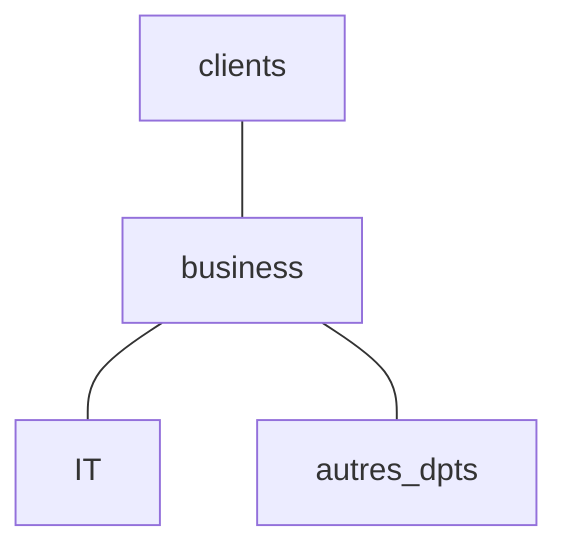
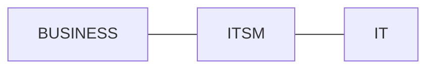

* @file cours.md
* @author Rod Guillaume
* @date 11 Sep 2018
* @copyright 2018 Rod Guillaume
* @brief <brief>

# Les slides du prof
Avec un **triangle rouge** on l'aura a la fin. Les autres non.

**ITSM**: Gestion de Services IT

# Baseline
> ligne départ je crois, il aime bien les mots anglais on dirait le boug.
> C'est introduction en gros...

Les mots clés en ITIL:
* Service
* Process
* Incident
* Problem
* ITIL
* Lifecycle
* ITSM
  * ITSM est inclus dans ITIL ? Idée fausse apparemment.
* Maturity (d'un process)
* PDCA
* RACI Matrix
* CMDB
* Continual Improvement
  * C'est lié avec *maturité* appremment
* CMMI
* Deming Wheel
* CMS
* SKMS

En terme de structure, on a:
1. SKMS (tout en haut, le plus méta)
1. CMS
1. CMDB

**PARTIEL** Ne pas confondre ITIL et ITSM, savoir exactement qui est quoi.

Faudra connaitre ces mots pour le partiel je pense.

**ITIL** sert de fil conducteur entre Business IT - Processus - Service.

# Relation Business IT

**Schéma simplifié de l'entreprise**:

Le client est en relation avec le business (métiers). Ce sont les metiers
business qui font marcher l'entreprise. L'IT contribue juste aux travaux des
metiers business.

L'entreprise est focalisée business.

> Bon y'a des schémas, j'espère qu'il nous filera les slides.

En fait **business** c'est juste pour parler des métiers dans l'entreprise.
Et **IT** c'est juste le DSI.

> Ce cours ça veut être que des buzzwords en anglais je le sens. ptdr

Le business a pas les memes objectifs. Business veut etre performant face aux
concurrents, au niveau benefices.

En IT on veut etre performants mais niveau informatique.

Le business suit juste ses chiffres, ses revenus.
L'IT surveille les chiffres de ses services informatiques.

Bon tout ça pour nous introduire la notion de **services**. ça permet d'avoir le
même langage entre ces deux mondes complètement opposés.

La **gestion de services** c'est ça justement. C'est gérer tous ces *services*
qui sont le langage commun entre IT et Business.

ITSM fait le pont entre business et IT.

L'ITSM ça permet au business d'intégrer l'IT dans les processus, donc du coup
ils perçoient plus l'IT comme des gens inutiles qui dépensent tout l'argent pour
rien.

# Perceptions de l'IT par le business

1. **Techno-Centric** IT comme un centre de cout (un pb)
1. **Service-Centric** IT comme un centre de services (une solution)
1. **Business-Centric** IT comme un centre d'innovation business (un partenaire strategique)

# ITSM ?

ITIL - definition de l'historique
ITSM - la gestion de services

* **Tout** ce que cela prend pour fournir des **services IT** effecients,
  fiables et de haute qualite satisfaisant les **besoins business**.
  * Aspects: humain, processus, technologie
  * Moyens: normes, cadres de reference, methodes, etc.

* ITSM est une *approche orientee **processus*** permettant de transformer une
  direction IT en un fournisseur de **services ayant une valeur au sens
  business**.

## ITSM, ce n'est pas...

* une solution technologique
  * HP Service Anywhere, ServiceNow, Remedy, Tivoli, etc.
  * Elles font parties de l'ITSM, mais **ce n'est pas ITSM**.
* Un standard
  * normes ISO etc.
* Un cadre de reference
  * ITIL, Six Sigma...

## ITSM est base sur des processus.

> voir slide 40, y'a les caracteristiques d'un processus.

# ITIL ?

**Information Technology Infrastructure Librabry**

Une bibliothèque des meilleures pratiques. C'est juste un ensemble de bouquins.

# EXEMPLE QUESTIONS PARTIEL

* C'est quoi ITIL, ITSM ?

* Une organisation de type *techno-centrique* est percue comme un probleme par le business.
Pourquoi ?

* Qu'est ce qui n'est pas dans les core publications d'ITIL ?
  * Service transition ? **OUI?**
  * Service optimization
  * Service design ? **OUI** ?
  * Service strategy

* The ITIL core is structured around?
  * An operations lifecycle
  * aN it managment lifecycle
  * A service lifecycle ? **OUI** ?
  * An infrastructure lifecycle ? **OUI** ?

  > TODO: trouver les reponses.

# ITIL concepts de base

## Un Service c'est...

> voir slide 55 (un service c'est...)
> Y'a la définition, les caracteristiques

**valeur** = utile (adapté) et garantie (utilisable)

> Garantie dans l'autre cours d'ITIL c'était *fiable*

**PARTIEL** Faire gaffe aux **OU** et **ET** dans le schéma des caracteristiques
d'un service. Apparemment il peut faire la biatch avec ça en partiel.

## Application VS Service

1. J'ai mon application, dans son environnement de test, toute seule.
1. Je mets mon application dans un environnement accessible par l'utilisateur
    final.
    1. On veut donc transformer notre application en *service*.
    1. On doit donc ajouter une structure, un support, me preoccuper de comment
      elle va vivre dans cet environnement de **prod** (encore un buzzword)
    1. On veut donc s'interesser a la vie de ce qu'on a cree.
