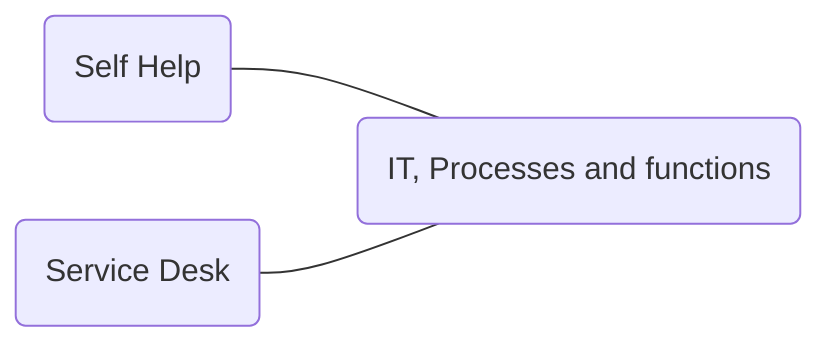
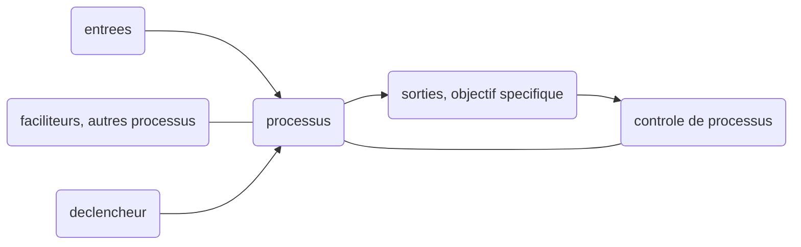

* @file cours2.md
* @author Rod Guillaume
* @date 18 Sep 2018
* @copyright 2018 Rod Guillaume

# Cours precedent

* Relation business-IT (image du pont là)
* Definition ITSM
* Notion de service
  * utilité et garantie (ses proprietes)
* cycle de vie du service

# Cycle de vie des services (5 phases)

1. strategie des services **Strategy**
1. Conception des services **Design**
1. Transition des services **Transition**
1. Exploitation des services **Operation**
1. Amelioration continue des services **CSI**
> Explications des differentes phases dispo dans les slides du prof.

*Principe fondamental des services* : Tout service doit apporter de la valeur
concrete, mesurable du point de vue des objectifs et des resultats business.

Chaque phase est caracterisee par des *concepts*, des *processus* et des
*fonctions*.

# Portefolio des services

* Pipeline des services
* Catalogue des services
* Services supprimés
  * Au cas ou on veut les remettre en service

# Conception de services

* SLA - **Service Level Agreement**
> Accord entre fournisseur et clients. On y definit les sibles du service, les
> responsabilites du fournisseur et client...
> Un SLA peut couvrir plusieurs services ou clients.

* OLA - **Operational Level Agreement**.
> Comme SLA, mais en interne de la boite.

* UC - Underpinning Contract (sous traitant)
  * Contrat entre fournisseur et une tierce partie
  * La tierce partie fournit des services ou biens au fournisseur pour repondre
    aux besoins de son client.
  * Pour l'entreprise tierce, c'est un SLA. Et pour le fournisseur et son sous
    traitant c'est un UC.

# Concepts de transition des Services

> Voir la slide avec tous les exemples.

## Changement

Ajout ou modification de tout composant pouvant avoir un effet direct ou
indirect sur les services fournis.

* CI
  * tout element indispensable pour founir un service
* CMDB
  * Gerer les CI tout au long de leur cycle de vie
* CMS
  * encapsule CMDB mais des infos qui sont dans des DB externes (KEDB, Changes...)
* SKMS
  * encore au dessus du CMS (ca osef, retiens pas forcement)

> **PARTIEL** surtout comprendre ce qu'est un CI, et savoir qu'il y a des couches au dessus, notamment CMS et CMDB.

## Baseline

Image, reference initiale. Permet de s'y referer, et de mesurer une evolution.

## DML - Definitive Media Library

bibliothèque des supports definitifs.

On y stocke toutes les versions **definitives et approuvees** des CI.
DML est une **zone de stockage** logicielle unique meme s'il y a plusieurs sites.

> **PARTIEL**
> What is the main reason for establishing a baseline ?
> 1. to standardize operation
> 1. for knowning the cost of services provided
> 1. for roles and responsability to be clear
> 1. **for later comparison**

> Which of the following would NOT be stored in the DML?
>
> 1. master copies of software
> 1. **backups of application data**
> 1. software licenses
> 1. master copies of controlled documentation

## Evenement

Changement significatif...
Notification...

> voir les slides

## Incident

interruption non planifiee d'un service ou une reduction de la QoS.

## Probleme

Raison d'un ou plusieurs incidents.

## Quality of Service VS Cout de service

On doit fournir des services au niveau de service convenus avec les clients et
users, en minimisants les couts et les ressources utilisees.

Le bon equilibre est determine au niveau des phases **Strategie** et
**Conception** dans les principes.

# CSI - Continuous Improvements Concepts

## Deming Wheel - PDCA

1. Plan
1. Do
1. Check
1. Act

A chaque iteration, on verifie les resultats et on ameliore en consequence a
chaque fois.

On consolide a chaque fois pour garantir un seuil.

# Les fonctions ITIL

unite organisationnelle, specialisee pour executer certaines types de travail.

> **PARTIEL** Ne pas confondre avec processus.

4 types de fonction:
1. Centre des services - Service Desk
1. Gestion Techniqe - Technical managment
1. gestion des operations - IT operations managment ITOM
1. Gestion des applications - applications managment

## Centre des Services

Vitrine de l'IT. Point de contact principal pour les users lorsqu'il y a une
interruption de service, demandes de service ou meme demande de changement.

C'est un point de communication et de coordination pour differents groupes et
processus informatique.

> On parle de **SPOC** - Single Point of Contact pour parler du *service desk*.

## Centre d'appels - call center

* Recevoir un volume important d'appels en provenance des users
* Enregistrer et transferer les appels vers les equipes competentes

## Centre de services

Il peut etre:
* local
* mutualisé
* virtuel

> voir slides pour details

# Processus

Ensemble d'activite structurees concues pour atteindre un **objectif
specifique**. On a des entrees qu'on transforme en resultat.

Un processus peut inclure la definition de *roles*, responsabilites, et *controles de gestion* necessaire pour fournir des *resultats* de maniere *fiable*.

Un processus peut etre formellement:
* decrit
  * clients, fournisseurs, entrees, sorties...
* mesuré
  * taux de defaut, temps de cycle...
* amélioré
  * variabilite a diminue, nb de defauts reduits, temps de cycle raccourci...

> Analogie avec une recette de cuisine pour faire un gateau.
> ingredients, temps de cuisson, resultat du gateau (apparence, gout)

## Exemples de processus

* Gestion des incidents
  * retablir le service le plus tot possible et de reduire l'impact defavorable
* Gestion des changements
  * on peut garantir la stabilite de la prod, donc on veut eviter d'impacter sur
    les autres services deja en place.

## Schema processus

## Elements generiques d'un processus

Elements que l'on retrouve a chaque processus:
* activite, flux
* roles
* procedure
* modes operatoires
* metriques
* elements d'Amelioration
  * c'est eux qui remontent dans le controle de processus

## Roles dans un processus

* gestionnaire du processus
* proprietaire du processus
* d'autres roles specifiques
  * analyse de probleme, d'incident, etc.

> Un meme individu peut jouer plusieurs roles.

On decompose une activite en procedure qu'on decompose en modes operatoires.

# Processus de Gestion des Incidents

## Objectif

Restaurer le service au SLA convenu.

Le but c'est de minimiser la duree d'interruption de service, pas d'apporter une
solution durable et robuste. On veut vite revenir aux conditions du SLA, pas un
truc magnifique qui va mettre plus de temps a se mettre en place.

Sont donc **hors perimetre** l'identification du probleme sous jacent ou la cause (PBM) ou la resolution du probleme sous jacent ou le remplacement du produit. (CHGM)

> PBM = Problem Managment
> CHGM = Change Managment

> **PARTIEL** Il va surement verifier qu'on a vu la difference entre **fonction** et **Processus**.
> Fonction etant une unite organisationnelle genre Service Desk etc.
> Et le processus c'est juste une espece d'algo qu'on deroule.
