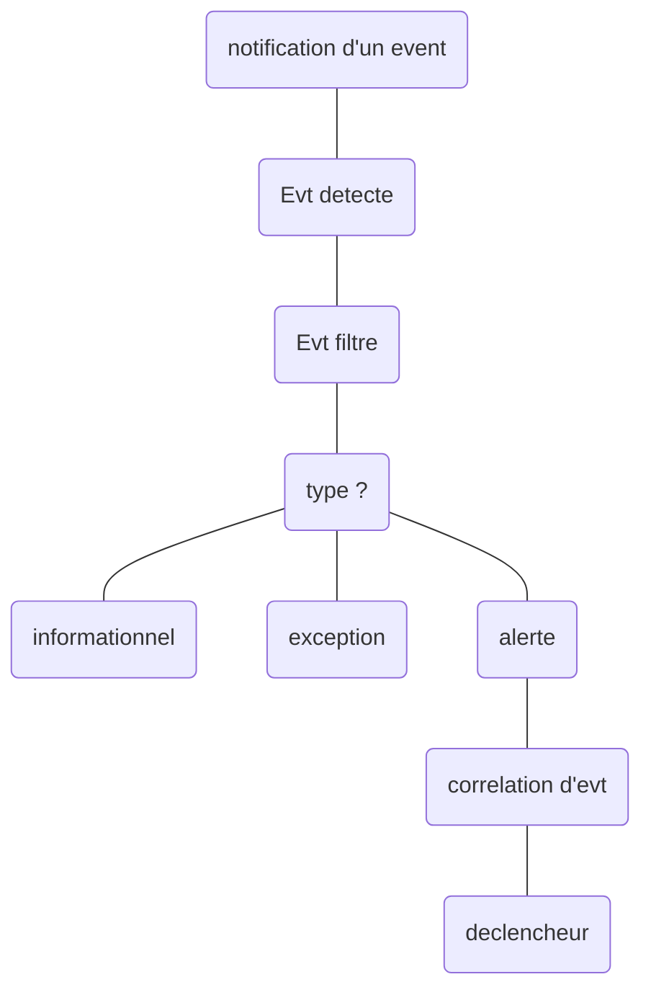
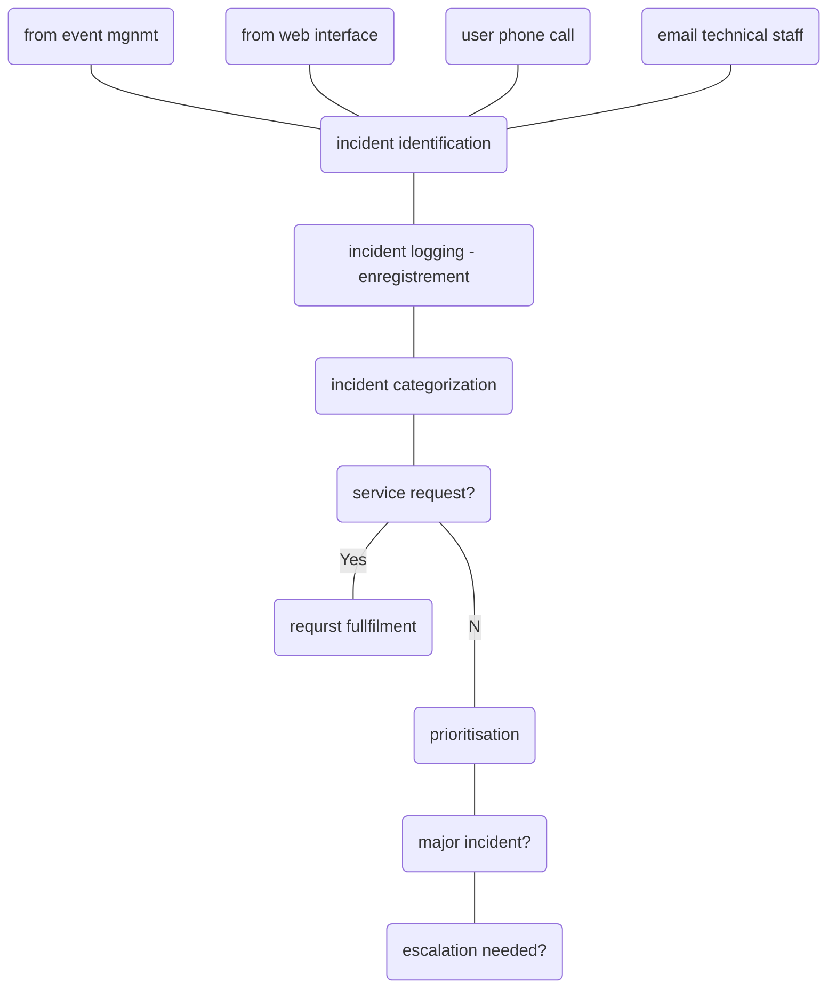

* @file cours3.md
* @author Rod Guillaume
* @date 25 Sep 2018
* @copyright 2018 Rod Guillaume
* @brief <brief>

# Questions pour le prof

* Pourquoi les processus permettent de garder la connnaissance au sein de
l'entreprise?
> Comme on creer les services, on apprend comment les faire et on documente ces connaissances (phases strategy et design).

* Permettent, aux services IT, d’être moins touchés par les changements
organisationnels
  * --> pourquoi? Car on a definit un cadre donc plus difficile de changer
    brutalement les choses ?
> C'est juste du a la notion de services. Quand y'a des nouveaux membres, ils
> s'ajoutent juste aux services existants. Le cadre bouge pas vraiment donc ca
> permet de pas etre touche par des changements.

# Toujours sur les processus....

# Les metriques

* Indicateur de mesure de qualite, d'efficacite, d'efficience, de conformite,
  etc.
* c'est un outil de benchmark, de diagnostique etc.
* on s'en sert pour ameliorer et diagnostiquer les processus.

Il y a deux types de metriques: Metriques informationnelles,et Indicateur cle
de performance (KPI).

## Metrique informationnelle

* fournit des infos supplementaires pour soutenir la gestion du processus, service
ou activite IT.

* ce sont des composants des parametrs qui definissent, soutiennent et ameliorent
un ensemble de KPIs.

> informationnelle c'est **statique**, ca donne des infos sur le service.

## Indicateur cle de performance (KPI)

* mesure servant a gerer un processus, un service IT ou une activite.
* de nombreuses mesures peuvent etre faites, mais seules les plus importantes
  sont definies comme des KPI. Elles servent a gerer des process et a etablir
  des rapports.

> Les KPI c'est pour suivre une evolution, suivre les perfs

## Exemples de metrics et KPI

> **Metriques**
Nb d'incidents ouverts, clos, nb de resolution d'incidents...

> **KPI**
Taux de resolution des incidents, taux d'incidents reouverts, temps moyen de
resolution d'un incident.

# Efficience VS Efficacite

## Efficience

* Mesure pour savoir si on a utilise la bonne quantite de ressources pour un
  processus, services etc.

* Atteindre un objectif en un minimum de temps et de ressources

> Efficience c'est plutot sur la gestion des ressources donc. On veut etre
> optimisé.

## Efficacite

* Mesure pour voir si on a atteint un objectif ou non.
> La on s'en fout des ressources et du temps.
> Un process efficace, c'est juste un process qui a fait ce qu'on voulait.

# RACI, matrice de responsabilités

* Responsable
  * realise la tache, contributeur actif a la tache
  * il fait la tache et doit rendre des comptes a la personne imputable
* Imputable (Accountable)
  * il doit repondre de la realisation de la tache
  * doit verifier que la tache a ete bien faite
* Consulté
  * Role qui doit etre consulte au cours de la realisation de la tache
* Informé
  * personne que l'on doit informer a l'issue du flux de travail.

NB: Un meme individu peut etre R et A.

> voir slides pour le details

> **Exemple**
Une boite envoie une equipe chez une boite.
L'equipe est responsable, et l'entreprise est imputable.

> Aussi souvent les managers sont *imputables* sur toutes les missions des
> membres de leur equipe.

## Regles generales

Dans chaque mission, y'a toujours :
* Une et une seule personne imputable
* au moins un R pour assurer qu'une personne ou fonction realise l'activite.
* Pas oblige d'avoir des C ou I.
* On veut donc **un unique A** et **au moins 1 R**.

## PARTIEL, exemples de questions

> **PARTIEL**

> A quoi sert la matrice RACI?
> identifier les responsabilités et roles de chaque personne.

> RACI - Donner la definition de chaque lettre de l'acronyme.

> Cycle de vie
Votre entreprise vous demande de developper une application pour la camapgne de promotion sur des articles de saison
Decrivez le cycle de vie de votre application.

> Cette matrice RACI est-elle correcte ?
Non, il manque un A. Y'a pas de gens amputable !!!

> What is the RACI model used for?
> 1. **Documenting the roles and relartionships of stakeholders in a process or activity**
> 1. Defining requirements for a new servic
> 1. Analyzing the business impact of an incident

> Which of the following statements is CORRECT ?
> 1. Only one person can be responsible for an activite.
> 2. **Only one person can be accountable for an activity**

> 1. Both
> 2. None
> 3. 1 only
> 4. **2 only**

# Exemples de processus

## EVM (gestion des événements)

* Surveille tous les events qui se produisent pour permettre le fonctionnement
  normal.
* Detecte et escalade les conditions d'exception
* Sert de base pour la surveillance et le controle operationnel des services et
  de l'infrastructure IT.

> procesus en charge de la gestion des events tout au long de leur cycle de vie.
> De la detection a la cloture du cas.

Types d'evenements:
* Information
  * log, stat, analayse.
* Avertissement
  * Service ou un equipement approche d'un seuil.
* Exception
  * Service ou equipement fonctionne actuellement anormalement.
  * risque OLA-SLA
  * impact business possible.

Le traitement d'un evenement peut conduire a l'ouverture d'un processus de
traitement d'incident. C'est pour ca qu'on met exception et pas incident.

### Activites en EVM

> voir slides pour les 9 activites

Le workflow c'est le chemin que nos activites prennent dans un processus.
Comment les composants s'enchainent dans le processus.

### Exemple de workflow sur la gestion de evenets

> En gros c'est le chemin de notre procedure de gestion d'event.
Pour savoir ou on envoie les events recus.

## INCM (gestion des incidents)

* Impact
  * par rapport au seuil de perf **business** qu'on attend.
  * au niveau d'un invidivu? entreprise? service?
    * on adapte en fonction de qui est touche par l'incident
* Urgence
  * toujours par rapport au **business**.
  * un incident qui a un fort impact, mais qui n'impact pas le business avant un
    an, c'est pas urgent.
* Priorite
  * Permet de catogoriser l'importance d'un incident, base sur l'impact et
    l'urgence.

### Incident majeur

Plus haute categorie d'impact sur le business.

> voir slides pour les types d'activites.

### Escalade (une des activites)

* Activite visant a obtenir des ressources supplementaires afin d'atteindre les
objectifs de niveau de services ou satisfaire les attentes du client.

* Elle peut etre necessaires pour tout procesus de gestion de services IT mais
c'est souvent associe a la gestion des incidents ou problemes.

2 types d'escalades:
* fonctionnelle
  * passer du support niveau 1 au niveau 2
  * on demande a des experts techniques de venir m'aider
* escalade hierarchique
  * solliciter le managment pour avoir des ressources pour pouvoir gerer dans
    les temps.

### Workflow INCM

> Les noeuds 1 2 3 4 sont des **declencheurs**.

> **PARTIEL**
> Do incidents include potential disruptions which have not yet occured?
> Yes.

> Must a user contact the service desk in order for an incident to be identified or can incidents be identified in other ways?
> Non y'a des outils pour les identifier automatiquement.

> Is the service desk the oly group allowed to log incident records....?
> Non c'est pas les seuls a pouvoir.

## PBM (gestion des problemes)

* Trouver la cause des incidents.
* Minimiser l'impac des ncidents et des problemes, eviter la repetition des
  incidents et ameliorer l'utilisation des ressources.

> **Probleme VS Incident**
> Analogie des pompiers.
> Y'a le feu, les pompiers doivent eteindre le plus rapidement le feu et eviter
> les degats.
> Ce n'est pas eux qui doivent aller chercher pourquoi y'a eu le feu, etc.
> Evidemment ils leur faut des infos supplementaires pour savoir comment
> eteindre le feu, mais c'est juste dans l'identification.

### Notion d'erreur

* defaut de la conception ou dysfonctionnement qui cause la defaillance d'un ou
  plusieurs services informatiques

### Notion d'erreur **connue**

* erreur qui a deja ete identifiee et dont on a une solution de contournement ou
  une solution permanante.
* Probleme pour lequel il existe une cause premiere et une solution de
  contournement documentee.
* Les erreurs connues sont crees et gerees tout au long de leur cycle de vie par
  la gesion des pb.
* elles peuvent aussi etre identifiees par le dvpment ou les fournisseurs.

### Notion de KEBD (base de donnees des erreurs connues)

Elle est creee par la gestion des pbs et utilisee par la gestion des incidents
et des pb.

Ca permet d'appliquer tout de suite une solution vu qu'on connait deja l'erreur.
La base permet de gerer facilement les incidents quand ils correspondent a une
erreur connue.

Ca ameliore l'efficience de la gestion des incidents.

> **Tout n'est pas evenement**, vu qu'on a vu dans le workflow des incidents y'a
> 4 declencheurs dont l'event mgmt.

### Triggers en gestion de pbs

tout probleme ne vient pas forcement d'un incident, vu qu'on fait de la
detection proactive etc.

En effet, un probleme est la cause d'incidents mais parfois on traite un
probleme en amont avant d'avoir des incidents.

Ca peut aussi venir de sous traitant ou fournisseurs.
