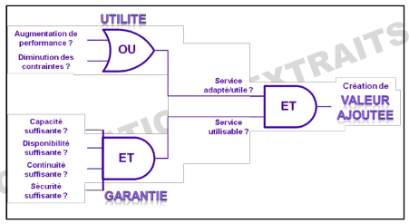
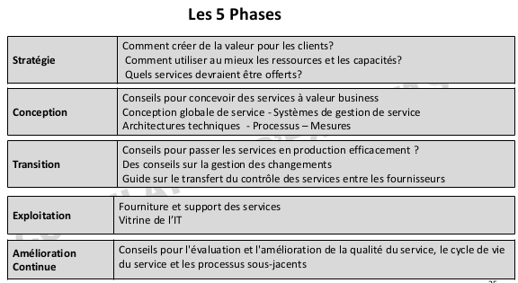
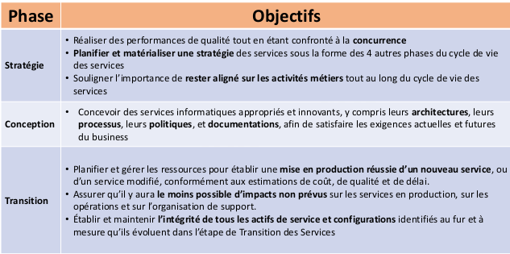
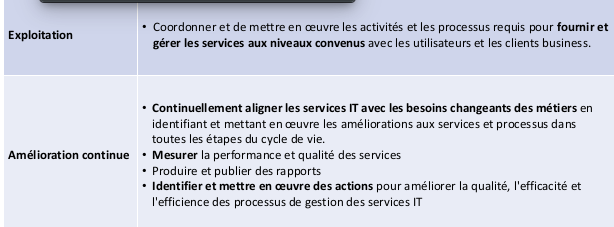
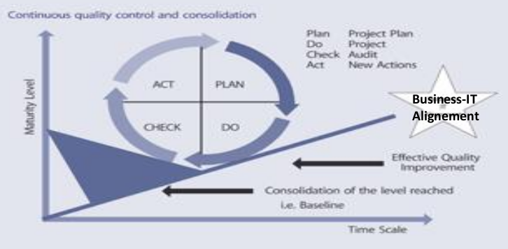
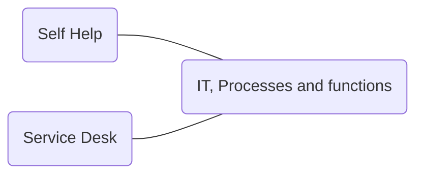
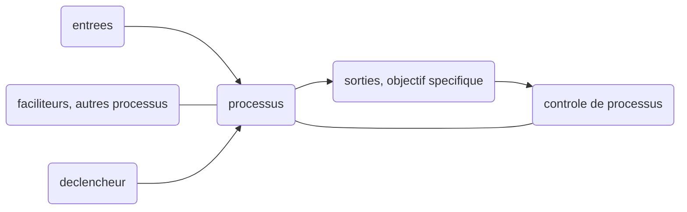
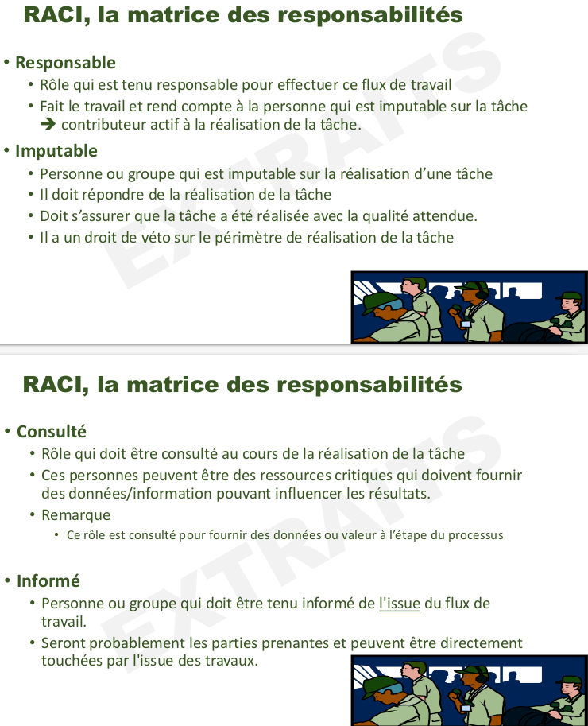
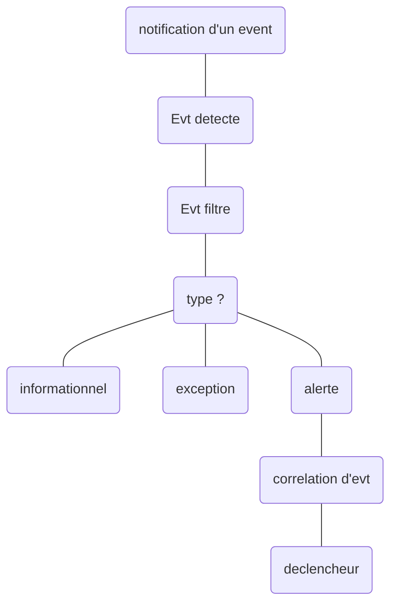
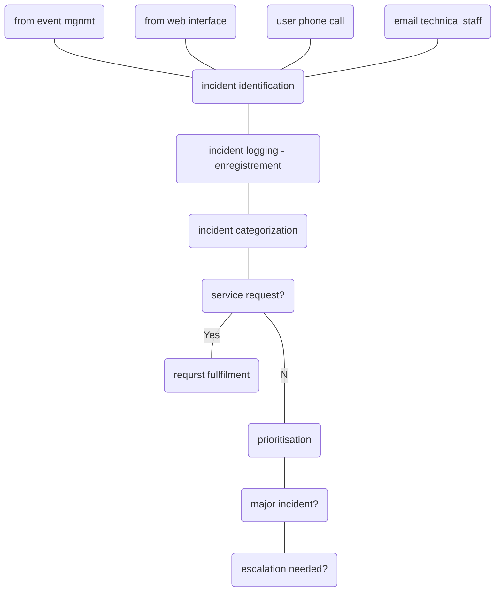

# PARTIEL - Exemples de questions

* C'est quoi ITIL, ITSM ?

---

* Une organisation de type *techno-centrique* est percue comme un probleme par le business.
Pourquoi ?

---

* Qu'est ce qui n'est pas dans les core publications d'ITIL ?
  * Service transition ? **OUI?**
  * Service optimization
  * Service design ? **OUI** ?
  * Service strategy

---

* The ITIL core is structured around?
  * An operations lifecycle
  * aN it managment lifecycle
  * A service lifecycle ? **OUI** ?
  * An infrastructure lifecycle ? **OUI** ?

Faire gaffe aux **OU** et **ET** dans le schéma des caracteristiques
d'un service. Apparemment il peut faire la biatch avec ça en partiel.

---

> What is the main reason for establishing a baseline ?
> 1. to standardize operation
> 1. for knowning the cost of services provided
> 1. for roles and responsability to be clear
> 1. **for later comparison**

---

> Which of the following would NOT be stored in the DML?
>
> 1. master copies of software
> 1. **backups of application data**
> 1. software licenses
> 1. master copies of controlled documentation

---

Il va surement verifier qu'on a vu la difference entre **fonction** et **Processus**.
> Fonction etant une unite organisationnelle genre Service Desk etc.
> Et le processus c'est juste une espece d'algo qu'on deroule.

---

> A quoi sert la matrice RACI?
> identifier les responsabilités et roles de chaque personne.

---

> RACI - Donner la definition de chaque lettre de l'acronyme.

---

> Cycle de vie
Votre entreprise vous demande de developper une application pour la camapgne de promotion sur des articles de saison
Decrivez le cycle de vie de votre application.

---

> Cette matrice RACI est-elle correcte ?
Non, il manque un A. Y'a pas de gens amputable !!!

---

> What is the RACI model used for?
> 1. **Documenting the roles and relartionships of stakeholders in a process or activity**
> 1. Defining requirements for a new servic
> 1. Analyzing the business impact of an incident

---

> Which of the following statements is CORRECT ?
> 1. Only one person can be responsible for an activite.
> 2. **Only one person can be accountable for an activity**

> 1. Both
> 2. None
> 3. 1 only
> 4. **2 only**

---

> Do incidents include potential disruptions which have not yet occured?
> Yes.

> Must a user contact the service desk in order for an incident to be identified or can incidents be identified in other ways?
> Non y'a des outils pour les identifier automatiquement.

> Is the service desk the oly group allowed to log incident records....?
> Non c'est pas les seuls a pouvoir.

# ITSM ?

ITIL - definition de l'historique
ITSM - la gestion de services

* **Tout** ce que cela prend pour fournir des **services IT** effecients,
  fiables et de haute qualite satisfaisant les **besoins business**.
  * Aspects: humain, processus, technologie
  * Moyens: normes, cadres de reference, methodes, etc.

* ITSM est une *approche orientee **processus*** permettant de transformer une
  direction IT en un fournisseur de **services ayant une valeur au sens
  business**.

## ITSM est base sur des processus.

* Peuvent être vérifiés, mesurés, comparés et améliorés
* Imposent davantage de rigueur à l’organisation
* Clarifient les frontières, les rôles et les responsabilités dans l’organisation
* Sont interdépendants
* Permettent de garder la connaissance au sein de l’organisation
* Permettent, aux services IT, d’être moins touchés par les changements
  organisationnels

**Information Technology Infrastructure Librabry** : Une bibliothèque des
meilleures pratiques. C'est juste un ensemble de bouquins.

# ITIL concepts de base

## Un Service c'est...

Un moyen d’apporter de la valeur à des clients en facilitant
les résultats que les clients veulent obtenir sans avoir la
propriété des coûts ou des risques spécifiques. Le terme
‘service’ est parfois utilisé comme synonyme pour ‘service
de base’, ‘service informatique’ ou ‘package de services’.

**valeur** = utile (adapté) et garantie (utilisable)

*Principe fondamental des services* : Tout service doit apporter de la valeur
concrete, mesurable du point de vue des objectifs et des resultats business.

> Garantie dans l'autre cours d'ITIL c'était *fiable*

## Application VS Service

1. J'ai mon application, dans son environnement de test, toute seule.
1. Je mets mon application dans un environnement accessible par l'utilisateur
    final.
    1. On veut donc transformer notre application en *service*.
    1. On doit donc ajouter une structure, un support, me preoccuper de comment
      elle va vivre dans cet environnement de **prod** (encore un buzzword)
    1. On veut donc s'interesser a la vie de ce qu'on a cree.

# Cycle de vie des services (5 phases)

1. strategie des services **Strategy**
1. Conception des services **Design**
1. Transition des services **Transition**
1. Exploitation des services **Operation**
1. Amelioration continue des services **CSI**

Chaque phase est caracterisee par des *concepts*, des *processus* et des
*fonctions*.

# 1. Concept de portefolio des services (Strategie)

C’est l’ensemble des services qui sont gérés par un fournisseur de services.
Le portefeuille des services sert à gérer le cycle de vie complet de tous les
services. Trois composantes principales :

* Pipeline des services
  * Base de données ou un document structuré établissant la liste de tous les
  services informatiques qui sont en considération ou en développement, mais ne
  sont pas encore disponibles aux clients.
  * Le pipeline des services fournit une vision business des éventuels services
  informatiques futurs et fait partie du portefeuille des services, qui n’est
  habituellement pas diffusé aux clients
* Catalogue des services
  * Base de données ou document structuré comportant des informations sur tous
  les services informatiques opérationnels, incluant ceux qui sont disponibles
  pour déploiement.
  * Il contient des informations sur deux types de services informatiques : les
  services qui sont visibles au business, et les services de soutien requis par
  le fournisseur de services afin d’offrir les services visibles au business
* Services supprimés
  * Au cas ou on veut les remettre en service on les garde

# 2. Conception de services (Conception - Design)

* SLA - **Service Level Agreement**
> Accord entre fournisseur et clients. On y definit les sibles du service, les
> responsabilites du fournisseur et client...
> Un SLA peut couvrir plusieurs services ou clients.

* OLA - **Operational Level Agreement**.
> Comme SLA, mais en interne de la boite.

* UC - Underpinning Contract (sous traitant)
  * Contrat entre fournisseur et une tierce partie
  * La tierce partie fournit des services ou biens au fournisseur pour repondre
    aux besoins de son client.
  * Pour l'entreprise tierce, c'est un SLA. Et pour le fournisseur et son sous
    traitant c'est un UC.

# 3. Concepts de transition des Services (Transition)

## Changement

Ajout, modification ou suppression de tout ‘composant’ pouvant avoir
un effet direct ou indirect sur les services fournis.

* Processus
* Fonction
* Documentation
* Equipes
* Etc.

## Elément de configuration (EC) - Configuration Item (CI)
* **Tout** ce qui doit être gérée afin d'offrir un service IT
* Il est enregistré dans le **système de gestion de configuration**
* Il est maintenu et suivi tout au long de son cycle de vie par le processus de
  gestion des configurations (SACM)
* Tous les CI sont sujets aux contrôles du processus de gestion des changements

> **Exemples**
> * Services
> * Matériel – Logiciel – Bâtiments
> * Personnes – Documentation - Processus
> * SLA

## CMDB (Configuration Management Data Base)

* Base de données servant à rassembler les enregistrements des éléments de
  configuration tout au long de leur cycle de vie.
* Dans cette base, à chaque élément de configuration sont associés un ensemble
  d’‘attributs’ requis pour une gestion optimale des services fournis.

## Système de Gestion des Configurations (CMS)

Ensemble d’outils et de bases de données servant à gérer les données de
configuration d’un fournisseur de services informatiques.

Le CMS comporte également des informations sur les incidents, problèmes, erreurs
connues, changements et mises en production ; et peut aussi contenir des
informations sur les employés, les sous-traitants, unités business, clients et
utilisateurs.

Le CMS comprend des outils pour collecter, stocker, gérer, mettre à jour et
présenter les données concernant tous les éléments de configuration et leurs
relations.

Le CMS est tenu à jour par la gestion des configurations et est utilisé par tous
les processus de gestion des services IT.

## Baseline

Image, reference initiale. Permet de s'y referer, et de mesurer une evolution.

## DML - Definitive Media Library

bibliothèque des supports definitifs.

On y stocke toutes les versions **definitives et approuvees** des CI.
DML est une **zone de stockage** logicielle unique meme s'il y a plusieurs sites.

# 4. Phase d'exploitation (Operation)

## Evenement

* Changement d’état significatif pour la gestion d’un service informatique ou de
tout autre élément de configuration.

* Alerte ou une notification créée par un service informatique, un
élément de configuration A ou un outil de surveillance.

## Incident

interruption non planifiee d'un service ou une reduction de la QoS.

## Probleme

Raison d'un ou plusieurs incidents.

## Quality of Service VS Cout de service

On doit fournir des services au niveau de service convenus avec les clients et
users, en minimisants les couts et les ressources utilisees.

Le bon equilibre est determine au niveau des phases **Strategie** et
**Conception** en principe.

# 5. Phase d'amélioration continue (CSI)

## Deming Wheel - PDCA

1. Plan
1. Do
1. Check
1. Act

A chaque iteration, on verifie les resultats et on ameliore en consequence a
chaque fois.

On consolide a chaque fois pour garantir un seuil.

> On a fini avec les phases du cycle de vie d'un service, on passe a autre
> chose.

# Les fonctions ITIL

* Une fonction est une unité organisationnelle, spécialisée pour exécuter
  certains types de travail et est responsable de résultats spécifiques.

* C’est une équipe ou un groupe de personnes qui mènent à bien un ou plusieurs
  processus ou activités

**Ne pas confondre *fonction* et *processus* !**

4 types de fonction en ITIL:
1. Centre des services - Service Desk
1. Gestion Techniqe - Technical managment
1. gestion des operations - IT operations managment ITOM
1. Gestion des applications - applications managment

## Centre des services - Service Desk

Vitrine de l'IT. Point de contact principal pour les users lorsqu'il y a une
interruption de service, demandes de service ou meme demande de changement.

C'est un point de communication et de coordination pour differents groupes et
processus informatique.

> On parle de **SPOC** - Single Point of Contact pour parler du *service desk*.

Il y a 3 types de Service Desk.

* Centre d’appels (Call center)
  * recevoir un volume important d’appels en provenance des utilisateurs.
  * Enregistrer et transférer les appels vers l’équipe compétente.

* Assistance technique (Help desk)
  * Traiter les incidents et les demandes informatiques aussi rapidement que
    possible en s’assurant qu’aucune demande ne se perd.

* Centre de services (Service Desk)
  * C’est aussi le plus complet .
  * En plus des services d’assistance technique, il offre une gamme plus étendue
    de services tels que :
    * le point de contact unique,
    * le pilotage et l’interface des processus ITIL.

En plus des 3 types de Centre de Services, on a egalement 3 types de
*structures*:

* Centre de services local
  * Il est situé sur le site et est destiné à assumer le support des
    utilisateurs locaux.

* Centre de services mutualisé
  * l’organisation qui possède plusieurs sites peut avantageusement remplacer
    plusieurs centres de services locaux par une organisation centralisée

* Centre de services virtuel (Follow The Sun)
  * ensemble de centres de services locaux répondant à l’ensemble des sites de
    l’entreprise
    * Proximité des techniciens en cas d’intervention sur site
    * Faculté de répondre à tous les sites quelle que soit l’heure de la journée

## Gestion Techniqe - Technical managment

* La Gestion Technique fournit les compétences techniques et le support
  nécessaire par ressource pour supporter l’exploitation courante de
  l’infrastructure informatique.

* La Gestion Technique joue également un rôle important dans la conception, les
  tests, la mise en production et l’amélioration des services informatiques

## gestion des operations - IT operations managment ITOM

* La Gestion des Opérations informatiques est la fonction responsable des
  activités opérationnelles quotidiennes requises pour gérer l’infrastructure
  informatique.

* Ceci est réalisé selon les standards de performance définis lors de la phase
  de Conception des Services (ITIL)

## Gestion des applications - applications managment

* La Gestion des Applications est responsable de la Gestion des Applications
  tout au long de leur cycle de vie.

* La fonction de Gestion des Applications supporte et maintient les applications
  opérationnelles et joue également un rôle important dans la conception, les
  tests et l’amélioration des applications qui constituent une partie des
  services informatiques.

On en a fini avec les *fonctions*, on passe aux *processus*.

# Processus

# Processus

Ensemble d'activite structurees concues pour atteindre un **objectif
specifique**. On a des entrees qu'on transforme en resultat.

Un processus peut inclure la definition de *roles*, responsabilites, et *controles de gestion* necessaire pour fournir des *resultats* de maniere *fiable*.

Un processus peut etre formellement:
* decrit
  * clients, fournisseurs, entrees, sorties...
* mesuré
  * taux de defaut, temps de cycle...
* amélioré
  * variabilite a diminue, nb de defauts reduits, temps de cycle raccourci...

> Analogie avec une recette de cuisine pour faire un gateau.
> ingredients, temps de cuisson, resultat du gateau (apparence, gout)

## Exemples de processus

* Gestion des incidents
  * retablir le service le plus tot possible et de reduire l'impact defavorable
* Gestion des changements
  * on peut garantir la stabilite de la prod, donc on veut eviter d'impacter sur
    les autres services deja en place.

## Schema processus

## Elements generiques d'un processus

Elements que l'on retrouve a chaque processus:
* activite, flux
* roles
* procedure
* modes operatoires
* metriques
* elements d'Amelioration
  * c'est eux qui remontent dans le controle de processus

## Roles dans un processus

* gestionnaire du processus
* proprietaire du processus
* d'autres roles specifiques
  * analyse de probleme, d'incident, etc.

> Un meme individu peut jouer plusieurs roles.

On decompose une activite en procedure qu'on decompose en modes operatoires.

# Processus de Gestion des Incidents

## Objectif

Restaurer le service au SLA convenu.

Le but c'est de minimiser la duree d'interruption de service, pas d'apporter une
solution durable et robuste. On veut vite revenir aux conditions du SLA, pas un
truc magnifique qui va mettre plus de temps a se mettre en place.

Sont donc **hors perimetre** l'identification du probleme sous jacent ou la cause (PBM) ou la resolution du probleme sous jacent ou le remplacement du produit. (CHGM)

> PBM = Problem Managment
> CHGM = Change Managment

# Les metriques

* Indicateur de mesure de qualite, d'efficacite, d'efficience, de conformite,
  etc.
* c'est un outil de benchmark, de diagnostique etc.
* on s'en sert pour ameliorer et diagnostiquer les processus.

Il y a deux types de metriques: Metriques informationnelles,et Indicateur cle
de performance (KPI).

## Metrique informationnelle

* fournit des infos supplementaires pour soutenir la gestion du processus, service
ou activite IT.

* ce sont des composants des parametrs qui definissent, soutiennent et ameliorent
un ensemble de KPIs.

> informationnelle c'est **statique**, ca donne des infos sur le service.

## Indicateur cle de performance (KPI)

* mesure servant a gerer un processus, un service IT ou une activite.
* de nombreuses mesures peuvent etre faites, mais seules les plus importantes
  sont definies comme des KPI. Elles servent a gerer des process et a etablir
  des rapports.

> Les KPI c'est pour suivre une evolution, suivre les perfs

## Exemples de metrics et KPI

> **Metriques**
Nb d'incidents ouverts, clos, nb de resolution d'incidents...

> **KPI**
Taux de resolution des incidents, taux d'incidents reouverts, temps moyen de
resolution d'un incident.

# Efficience VS Efficacite

## Efficience

* Mesure pour savoir si on a utilise la bonne quantite de ressources pour un
  processus, services etc.

* Atteindre un objectif en un minimum de temps et de ressources

> Efficience c'est plutot sur la gestion des ressources donc. On veut etre
> optimisé.

## Efficacite

* Mesure pour voir si on a atteint un objectif ou non.
> La on s'en fout des ressources et du temps.
> Un process efficace, c'est juste un process qui a fait ce qu'on voulait.

# RACI, matrice de responsabilités

* Responsable
  * realise la tache, contributeur actif a la tache
  * il fait la tache et doit rendre des comptes a la personne imputable
* Imputable (Accountable)
  * il doit repondre de la realisation de la tache
  * doit verifier que la tache a ete bien faite
* Consulté
  * Role qui doit etre consulte au cours de la realisation de la tache
* Informé
  * personne que l'on doit informer a l'issue du flux de travail.

> **Exemple**
Une boite envoie une equipe chez une boite.
L'equipe est responsable, et l'entreprise est imputable.

> Aussi souvent les managers sont *imputables* sur toutes les missions des
> membres de leur equipe.

## Regles generales

Dans chaque mission, y'a toujours :
* Une et une seule personne imputable
* au moins un R pour assurer qu'une personne ou fonction realise l'activite.
* Pas oblige d'avoir des C ou I.
* On veut donc **un unique A** et **au moins 1 R**.

# Exemples de processus

## EVM (gestion des événements)

* Surveille tous les events qui se produisent pour permettre le fonctionnement
  normal.
* Detecte et escalade les conditions d'exception
* Sert de base pour la surveillance et le controle operationnel des services et
  de l'infrastructure IT.

> procesus en charge de la gestion des events tout au long de leur cycle de vie.
> De la detection a la cloture du cas.

Types d'evenements:
* Information
  * log, stat, analayse.
* Avertissement
  * Service ou un equipement approche d'un seuil.
* Exception
  * Service ou equipement fonctionne actuellement anormalement.
  * risque OLA-SLA
  * impact business possible.

Le traitement d'un evenement peut conduire a l'ouverture d'un processus de
traitement d'incident. C'est pour ca qu'on met exception et pas incident.

### Activites en EVM

1. Notification
2. Détection
3. Filtrage
4. Signification
5. Corrélation
6. Déclencheur
7. Choix de réponse
8. Actions de revue
9. Clôture

Le workflow c'est le chemin que nos activites prennent dans un processus.
Comment les composants s'enchainent dans le processus.

### Exemple de workflow sur la gestion de evenets

> En gros c'est le chemin de notre procedure de gestion d'event.
Pour savoir ou on envoie les events recus.

## INCM (gestion des incidents)

* Impact
  * par rapport au seuil de perf **business** qu'on attend.
  * au niveau d'un invidivu? entreprise? service?
    * on adapte en fonction de qui est touche par l'incident
* Urgence
  * toujours par rapport au **business**.
  * un incident qui a un fort impact, mais qui n'impact pas le business avant un
    an, c'est pas urgent.
* Priorite
  * Permet de catogoriser l'importance d'un incident, base sur l'impact et
    l'urgence.

### Incident majeur

Plus haute categorie d'impact sur le business.

### Activite en INCM

1. Identification
1. Enregistrement
1. Catégorisation
1. Priorisation
1. Diagnostic initial
1. Escalade
1. Investigation & Diagnostic
1. Résolution & Reprise
1. Fermeture/Clôture

### Escalade (une des activites)

* Activite visant a obtenir des ressources supplementaires afin d'atteindre les
objectifs de niveau de services ou satisfaire les attentes du client.

* Elle peut etre necessaires pour tout procesus de gestion de services IT mais
c'est souvent associe a la gestion des incidents ou problemes.

2 types d'escalades:
* fonctionnelle
  * passer du support niveau 1 au niveau 2
  * on demande a des experts techniques de venir m'aider
* escalade hierarchique
  * solliciter le managment pour avoir des ressources pour pouvoir gerer dans
    les temps.

### Workflow INCM

> Les noeuds 1 2 3 4 sont des **declencheurs**.

## PBM (gestion des problemes)

* Trouver la cause des incidents.
* Minimiser l'impac des ncidents et des problemes, eviter la repetition des
  incidents et ameliorer l'utilisation des ressources.

> **Probleme VS Incident**
> Analogie des pompiers.
> Y'a le feu, les pompiers doivent eteindre le plus rapidement le feu et eviter
> les degats.
> Ce n'est pas eux qui doivent aller chercher pourquoi y'a eu le feu, etc.
> Evidemment ils leur faut des infos supplementaires pour savoir comment
> eteindre le feu, mais c'est juste dans l'identification.

### Notion d'erreur

* defaut de la conception ou dysfonctionnement qui cause la defaillance d'un ou
  plusieurs services informatiques

### Notion d'erreur **connue**

* erreur qui a deja ete identifiee et dont on a une solution de contournement ou
  une solution permanante.
* Probleme pour lequel il existe une cause premiere et une solution de
  contournement documentee.
* Les erreurs connues sont crees et gerees tout au long de leur cycle de vie par
  la gesion des pb.
* elles peuvent aussi etre identifiees par le dvpment ou les fournisseurs.

### Notion de KEBD (base de donnees des erreurs connues)

Elle est creee par la gestion des pbs et utilisee par la gestion des incidents
et des pb.

Ca permet d'appliquer tout de suite une solution vu qu'on connait deja l'erreur.
La base permet de gerer facilement les incidents quand ils correspondent a une
erreur connue.

Ca ameliore l'efficience de la gestion des incidents.

> **Tout n'est pas evenement**, vu qu'on a vu dans le workflow des incidents y'a
> 4 declencheurs dont l'event mgmt.

### Triggers en gestion de pbs

tout probleme ne vient pas forcement d'un incident, vu qu'on fait de la
detection proactive etc.

En effet, un probleme est la cause d'incidents mais parfois on traite un
probleme en amont avant d'avoir des incidents.

Ca peut aussi venir de sous traitant ou fournisseurs.
