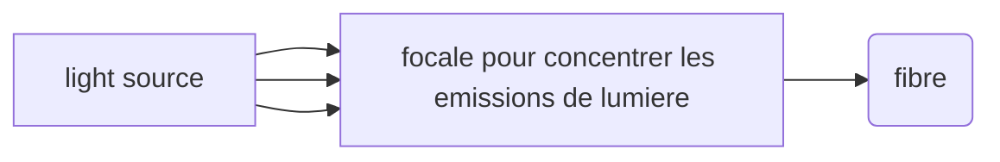

* @file cours1.md
* @author Rod Guillaume
* @date 27 Nov 2018
* @copyright 2018 Rod Guillaume
* @brief Fibre optique? Comment l'utiliser pour faire de la transmission d'info sur de grandes distances?

# History

## Low loss optical fibre 70s

Permet de cabler en optique sur 3km (20dB de perte par km, on considere qu'on a
le droit a 60dB de perte en tout pour etre capable de retrouver le message)

## Amplificateur fibre optique 80s

Avant c'etait amplifier electrique, donc on etait limite par l'electrique. Donc
des debits a 500Mbps.

Apres on a pu passer aux Gbps.

# Nature of light

La longueur d'onde de 0.8 a 1.7 (near infra red) c'est parce que la dans cet
intervalle que la silice (le verre) est le plus transparent.

# Structure of an optical fiber

*optical cladding* = gaine optique

# Propagation dans la fibre optique

Angle d'acceptance = angle d'incidence maximale, donné par les constructeurs de
la fibre.

L'angle d'acceptance permet de creer ce cone qu'on voit sur le schema slide 19.
Ca decrit la zone depuis laquelle on peut envoyer des signaux sans qu'ils se
perdent.

# Multi-mode optical fiber

Sauf que les 3 impulsions qu'on a envoyees presque au meme moment arrivent a des
moments differents vu qu'elles ont pas le meme angle d'incidence dans le coeur
donc ont des vitesses differentes.

> cf slide 20

J'ai l'impression que "mode" c'est l'ecart entre l'horizontal et la ou
l'impulsion a tapé dans la focale qui concentre les rayons.
Plus t'es proche de l'axe plus t'iras vite. Moins t'es proche plus le signal va se reflechir et perdre du temps.

# 2 categories de fibre multi-mode

*Step index fiber*: changement brutal de valeur de *n* entre la gaine et le
coeur, donc trajectoire rectiligne.

*Graded index fiber*: On compense la perte de vitesse grace au profil en
gradiant d'indice. En gros comme les signaux ne voient pas la meme valeur de n,
ils font pas exactement le meme chemin donc ca permet d'equilibrer la vitesse
entre les deux.

Gradient d'indices = le meilleur pour avoir le plus faible dispersion modale.

# Comment faire du monomode ?

Notion de *frequence normalisee $V$*.

$a$ = rayon du coeur de la fibre
$\lambda_0$ = longueur d'ondre de ce qu'on veut envoyer

Ca permet de donner un ordre de grandeur du nombre de modes de propagation.

*Mode*: Nombre de rayons qui ont un angle d'incidence different

On remarque deja que y'a 2 fois moins de modes avec un gradiant d'indice par
rapport a un step index.

Selon la valeur de $V$, on a plusieurs modes de propagation.

A gauche du trait a `2, 405`, on a uniquement le mode fondamental et ensuite on
passe a faiblement multimode, jusqu'a fortement multi mode.

Une fibre est *monomode* quand $V \lt 2, 405$.

Donc pour fabriquer du monomode, et donc un faible V, il faut jouer avec le
diametre du coeur $a$ ou les indices $n_1$ et $n_2$.

Monomode = faible diametre de coeur et faible difference d'indice (donc faible
cone d'acceptance vu qu'on reduit l'ouverture numerique).
On veut un V faible.

Comme on veut un diametre faible, c'est pour ca qu'on utilise des laser. On a
besoin d'etre precis et concentré.

# Longueur d'onde de coupure

Les fibres "monomodes" ca existe pas vraiment. Il existe une longueur d'onde
dite de *coupure*, correspondant a $V = 2,405$. Il faudra utiliser des longueurs
d'ondes superieures a cette longueur d'onde de coupure pour eviter le multimode.

> slide 31

# Attenuation

On a une relation $P(z)$ mais elle fait apparaitre des Neper/m, mais dans la
vraie vie on utilise l'Attenuation en db/kms

$$ A = \frac{1}{L} \times 10 \log(\frac{P_{in}}{P_{out}}) $$

La fraction Pin et Pout c'est justement les dB. db c'est une difference entre
deux puissances.

L c'est la longueur en km.

# Dispersion chromatique

Une fibre monomode n'a pas de dispersion modale mais a une dispersion
chromatique.

$Dc$ = dispersion chromatique

> Formule slide 41

Cette courbe permet de trouver $\lambda_0$. Cette longueur d'onde permet
d'annuler la dispersion chromatique (ou du moins l'attenuer au maximum).

En plus de la dispersion liee au materiau, y'a aussi une dispersion liee au
guide. Le cercle n'est evidemment pas parfait.

On appelle ces defauts *optogeometrique*. Ils contribuent a une autre cause de
dispersion chromatique.

Il y a donc deux causes de dispersion chromatique.

> slide 43

Pour avoir la fibre ideale il faudrai donc arriver dans la 3e fenetre pour une
attenuation minimale et etre avec un $\lambda_0$ parfait pour eviter la
dispersion.

> Slide 44, on voit que la dispersion est plus faible a 1.3 que a 1.55 (donc
> dans la seconde fenetre)

C'est pour ca qu'on a la *dispersion shifted fiber*, qui decale la dispersion
pour pouvoir avoir le truc optimal pour 1.55.

Mais pour decaler on est oblige de mettre un "dopant" dans le coeur. Mais du
coup ca rajoute des impuretes et donc ca creer de l'attenuation...

On a donc deux types de fibres: standard singlemode fiber (SMF) et la dispersion
shifted fiber (DSF).

# Fabrication de fibre

On a un *preforme* (une espece de version grande de la fibre avec gaine et
coeur) et on fait fondre pour que ca coule. Et en coulant ca devient plus fin
mais avec les memes proprortions.

> slide 51
