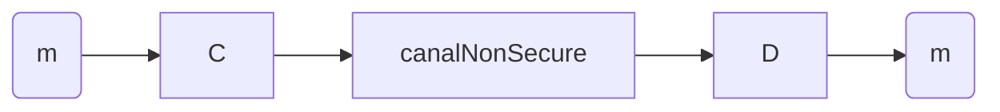
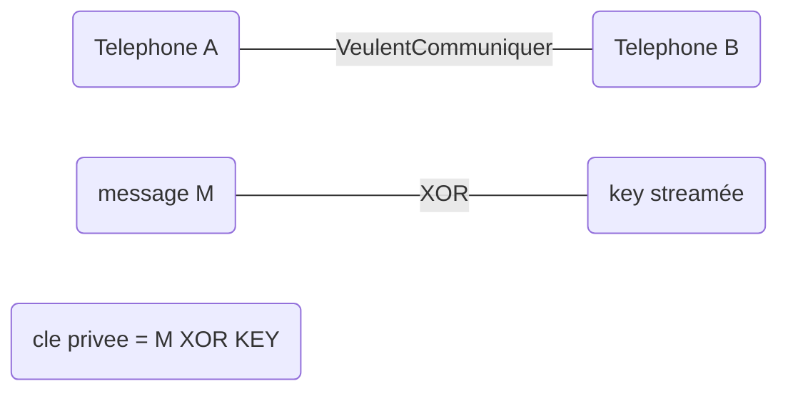

* @file cours3.md
* @author Rod Guillaume
* @date 15 Oct 2018
* @copyright 2018 Rod Guillaume
* @brief DES, 3DES et AES

> PARTIEL
**modes of operation**, pour le partiel faut pas savoir coder les algos mais
savoir quand les utiliser.

**mode electronique**: prend le message, le chiffre,
Ca permet de chainer les blocs apparemment ?
> **TODO** demander au prof pour le mode elec. j'ai pas eu le temps de bien
> noter.
> Y'a du mode de chiffrement fait pour le disque dur, et d'autre pour le web.

Crée par la NSA donc vaut mieux s'en méfier.

AES: conçu pour ne pas avoir les failles connues en 2000 sur DES

> Rien a voir avec le cours, mais il a tester un server SSL avec Qualys.

# Chiffrement symetrique

Y'a d'autres termes pour parler de chiffrement symetrique, comme *secret-key*,
*single-key*, *one-key*, *classical encryption* ou *private-key encryption*.

secret = connu par les destinataires.
privé = uniquement par une personne

2 modes de chiffrement symetrique:

* stream cipher

Par contre pour les appels telephoniques, c'est code sur la voix des telephones.
Mais si la conversation dure trop longtemps faut regenerer la cle. Du coup on
utilise un *seed*.

* block cipher

Au lieu d'encoder bit par bit, on encode bloc par bloc.

On utilise que des block cipher maintenant.
AES ce sont des blocks de 128 bits, 196 bits ou 256 bits.

AES Contest, Rijndael a gagne en octobre 2000.

* MARS IBM
* RC6, boite RSA
* Serpent
* Twofish
* nDES (DES et 2DEs sont morts, 3DS encore la mais deconseille)
* FORTEZZA (developper pour espionner tous les citoyens americains (chiffre et
  recupere pour toutes les conversations et les envoyer a la NSA))

Block = aujourd'hui, on trouve 64, 128, 256 ou 196 (juste en AES pour 196) bits

# Block cipher modes of operation

Est-ce qu'on lie les blocs entre eux?
> C'est genant quand tu recuperes pas un des blocs, tu perds tout vu qu'ils sont
> tous chaines.

Sur les longs messages c'est pas forcement malin de faire paquet par paquet,
surtout si y'a de la redondance. On va toujours deviner le message.

Quand tu chaines ca enleve la redondance.

* ECB (electronic codebook)
  * on fait rien, on chiffre chaque bloc
* CBC (Cipher block chaning) OFB (output feedback) CFB (cipher feedback)
  * modes de chainage standards
  * Besoin du bloc precedent pour dechiffrer le bloc
* CTR (Counter mode)
  * les blocs sont independants mais on creer de la difference sur les
    redondances grace a un compteur.
  * "mode satellite"

# Confusion, Diffusion

> Voir slides, y'a la definition complete des deux.

Confusion = pas de relation entre l'entree et la sortie
Diffusion = on doit pas savoir quel algo a ete utiliser

> C'est pas les definitions des slides, donc relis les t'es gentil.

* Substitution (pour la diffusion): on change l'alphabet. on remplace un symbole
par un autre.
* Permutation (transposition): on echange des blocs dans le message lui meme.

> Avec une image, la permutation ca bouge un peu l'information mais on peut
> deviner un tout petit peu.
> La substitution c'est abuse on devine l'image. Ca "repeint" juste l'image.

Si on combine les deux par contre c'est cool.

Ajd tous les algos de chiffrement (symetrique) dans TLS utilisent les deux
entremeles.

# DES

> Dans 3DES ils melent chiffrement et dechiffrement pour compliquer les choses

Par IBM et Feistel, gagne le concours NBS en 75.
Modifie derriere par la NSA.

1. On permute le message
2. On coupe chaque bloc en 2 blocs de 32 bits et on applique les cles Li et Ri.
  1. 16 "rounds", des iterations
  1. "round function"
3. On permute inverse

> Regarde les slides, c'est pas clair mes notes la.

Feistel function ou substitution transposition network.

## Table de substitution, S-Box

Chaque ligne est une permutation des entiers de 0 a 15.
Pour rester bijectif, faut que sur chaque colone on est pas 2 fois la meme
valeur.
