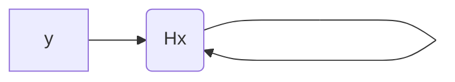

* @file cours4.md
* @author Rod Guillaume
* @date 15 Oct 2018
* @copyright 2018 Rod Guillaume
* @brief Presentation fonctionnement AES

> Rien a voir, mais il conseille OSINT pour faire des recherches.

# AES (suite)

> Rinjdael animation v4 eng, la petite video de fonctionnement d'AES

Dans *SubBytes*, *BinaryToField()* ca transforme un nombre binaire en un nombre dans un corps (oublie pas, field == corps).

La fonction SubBytes permet de calculer la SBox. Suffit de calculer pour les 255 octets possibles.

# Hash functions

> md5

Message M, $ |H(M)| = fixe $

## Weak Collision Resistant

