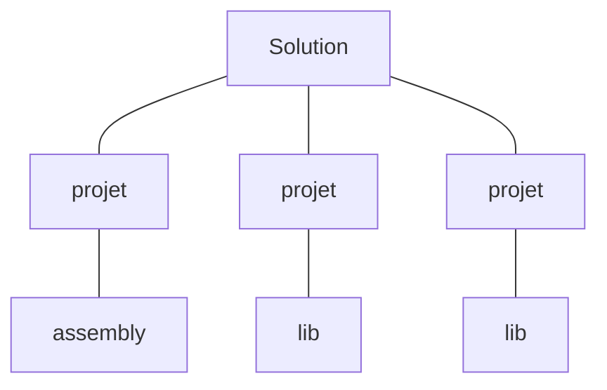

# Architecture d'un projet .NET

Un projet Visual Studio, c'est pas juste un projet. En fait tu creer une
solution qui peut apres contenir plusieurs projets.

* `Solution`
* `Projets` dans solution, independants et isoles.
* Ces projets quand ils sont compiles ou transformes en lib, on ca appelle des
  `assemblies`.



# .NET Standard vs .NET Core

Depuis je sais plus quand t'as Std et Core. Core c'est un mini .NET pour faire
des micro services etc.

# namespace

Un `namespace` ca permet de ranger nos classes dans une grosse boite.

Du coup tu peux avoir un Main par mainspace etc. Son vrai nom ca sera
namespace.Main().

`using` c'est pas un import. c'est pour nous eviter de toujours donner le
fullname des trucs.
Les `dll` on les import autre part.

# Class vs Struct

* struct pas de gc
* classe gc'd

# Classes

Par defaut une classe est `private`.

Quand t'es private, c'est au niveau de l'assembly. Donc au sein d'un meme projet
toutes les classes se voient.

# Properties

```csharp
class Toto {
  int age;

  // Ca creer des accesseurs automatiquement
  public int Age {
    get;
    set;
  }

  public void myFunc() {
    var toto = new Toto();
    toto.Age++; // on s'en sert comme des variables
  }
}
```

# Zones de memoire en .NET

```csharp
struct Chat {
  int age;

  // Ca creer des accesseurs automatiquement
  public int Age {
    get;
    set;
  }
  static void Vieillir();
}

class Chat {
  int age;

  // Ca creer des accesseurs automatiquement
  public int Age {
    get;
    set;
  }

  static void Vieillir();
}

Main() {
  var felix = Chat();
  var medor = Chien();

  print('age de medor' + medor.Age); // 0
  print('age de felix' + felix.Age); // 0
  Chien.vieillir(medor); // reference
  Chat.vieillir(felix); // copie
  print('age de medor' + medor.Age); // 1
  print('age de felix' + felix.Age); // 0
}
```

Pile et tas, comme d'habitude. Les deux sont independantes.

La pile c'est pas manage'd, vu que c'est juste les variables du thread etc.
Le tas, c'est gc'd.

Les struct sont dans la pile. `COPIE`
Les classes c'est dans la heap. `REFERENCE`

Dans les structs aussi t'es oblige d'init les valeurs, vu que c'est pas des
refs.

# Garbage Collector

.NET fragmente la memoire.

## Java vs .NET

* Java: 10 declenchement d'1 temps memoire
* .NET: 1 declenchement de 10 temps memoire

.NET il lance le gc plus rarement que Java. Mais du coup quand il se lance le
programme ralentit sa race. Par contre a l'utilisation ca va plus vite vu que le
gc se lance moins.

Le gc de .NET, il a un systeme de 'plus le gc est passe sans supprimer un objet,
plus cet objet va rester en memoire lgtps'.

Donc .NET il lance la memoire s'accumuler a mort, et il defragmente tout d'un
coup.

# Properties (continue'd)

```csharp

int age;

public int Age {
  get { return age; }
  private set { age = value; }
}
```

# Dispose()

Dispose c'est pas vraiment lie au GC.
En gros c'est plutot pour fermer des verrous sur des trucs exterieurs.
Genre fermer la connexion avec un fichier, avec une DB ...

# Event

event = pointeur sur liste de pointeurs de fonctions

Delegate = prototype defini pour une fonction

Un event est tjr associe a un `delegate` qui definit le type des fonctions.

Souvent le delegate retourne void et prend 2 args.

`void delegate(objet sender, eventArg)`

Le eventArg c'est un machin que tu peux typer. Ca doit etre une espece de
generics.

Y'a deja un delegate de base `EventHandler`

# GUI Windows Forms

On code dans Form.cs
Le Form.designer.cs c'est un fichier pour VS, on y touche pas souvent.

Du coup pour rajouter nos events dans notre liste d'event, c'est dans le main du Form.cs

Tu fais genre:

```csharp
this.button.Click += MyFunc1;
this.button.Click += MyFunc2;
this.button.Click += MyFunc3;
```

```csharp
// c'est un type, comme une classe
public delegate void AgeEventHandler(object sender, int age);
// delegue, prototype des fonctions dans la liste

class Chien {
  public event AgeEventHandler Vieillir; // liste de pointeur (comme CLick)
}
// Vieillir = liste de pointeurs
// Type de cette liste Vieillir, c'est un delegue (ici AgeEventHandler).
```

# Monter une DB en local sur VS

1. Explorateur de serveurs
2. Ajouter une connexion a une DB
3. Fichier de BDD SQL Server

> Ca permet de monter une DB dans Visual Studio directement et de sauter
> l'installation de SQL Server et SSMS.

# Queries en C#

* `ExecuteNonQuery` = retourne le nombre de lignes impactees par le changement (donc pour UPDATE, INSERT, DELETE)
* `ExecuteReader` = lit ligne par ligne
* `ExecuteScalar` = retourne un entier (donc genre pour count)
