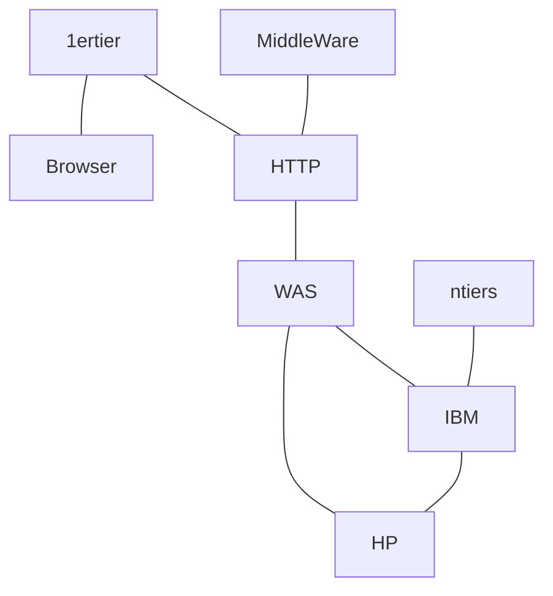

* @file cours1.md
* @author Rod Guillaume
* @date 5 Nov 2018
* @copyright 2018 Rod Guillaume
* @brief zSeries MainFrame
* @contact michel_leduy@fr.ibm.com Michel Le Duy

> C'est un cours en partenariat avec IBM pour nous apprendre le MainFrame, et
> aussi pour venir nous recruter.

# Historique

Thomas Watson Jr le 7 avril 1964, il place 5 milliards de dollars pour creer le
mainframe.

Il voulait remodeler l'industrie, reinventer le business...

* `1964` S/360
  * Les entreprises peuvent enfin executer des applications sur une
    plateforme hautement sécurisée.

Des le depart, les mainframes ont ete cree dans une optique de **sécurité**. Et
aujourd'hui, on garde toujours des mainframe pour des questions de securite pour
les donnees les plus critiques. On a un systeme hybride cloud/mainframe.

  * La meme annee, IBM lance avec American Airlines le projet Systeme Sabe.

> Sabre est un système de réservation informatique ou "Global Distribution
> System" (GDS) pour le transport ferroviaire et aérien de passagers, ainsi
> que pour l'hôtellerie et les autres prestations de tourisme. Les quatre plus
> importants GDS sont l'Espagnol Amadeus, ainsi que les Américains Sabre,
> Galileo, et WorldSpan. -- Wikipedia

Je sais pas pourquoi mais il nous parle d'ACID. Surement pour dire que les
mainframes sont bases sur ce principe.

* Atomicite = composant, modules
* Consistency = on fait des choses carres, on revient pas dessus
* Isolation = tous le meme peut utiliser un programme, mais c'est isole. comme
  si c'etait sur ton pc.
* Durable

La il parle des images du systeme, des backups, pour faire des rollbacks a
chaud.
Peut etre pour rester ACID tout le temps ?

On appelle ca des **Before Journal** les images qui permettent de restaurer.
Y'a aussi des **After Journal** qui permettent de restaurer la ou y'a eu le
crash.

Meme SNCF est en partenariat avec ce systeme de reservation. On peut reserver
des trains SNCF sur uTrack Americain et tout.

* `1969` Des System/360 modeles 75 et 95 ont aide les missions Appolo pour aller
  sur la lune.

* `1972` Virtualisation firmware/hardware. **z/VM**

Virtualisation Firmware VS Software

* Software s'execute sur le HW.
* Si on fait de la virtualisation firmware, ca va beaucoup plus vite.

La virtualisation ca permet de mieux utiliser ses ressources. Sur UNE machine on
peut lancer plein de VM pour nos programmes au lieu d'1.

TCO/TCA => cout sur 3/5 ans d'un materiel pour connaire

* Total Cost Owner = inclus le TCA + le cout de fonctionnement (electricite,
  employes, softwares)
* Total Cost Acquisition = cout de base, qu'on connait

* `1994` Haute disponibilite
  * IBM annonce le Parallel Sysplex pour le System/390, et les *FiveNines* (99,999%)
    > 5 minutes de down par an.

Comme les entreprises ont souvent 2-3 machines IBM, ca permet a IBM de faire les
updates et maintenances sans que ca se ressentent.

> In computing, a Parallel Sysplex is a cluster of IBM mainframes acting
> together as a single system image with z/OS. Used for disaster recovery,
> Parallel Sysplex combines data sharing and parallel computing to allow a
> cluster of up to 32 systems to share a workload for high performance and high
> availability. - Wikipedia

> B2Employee, B2Customer, B2Business

Internet = B2C
Intranet = B2E
Extranet = B2B, pour discuter entre differents *business partners*.

* `1994` la meme annee, IBM met en oeuvre la techno CMOS : la minuaturisation.

* `2000` Linux fait son apparition sur le grand systeme IBM
  > IBM utilise des technologies de pointe et suit les normes ouvertes

* `2000` lancement de la gamme zSeries et du z/OS en **64 bits**
> 64 bits en software, pour que les entreprises puissent plus facilement faire
> des calculs.
> Avant on se servait de l'informatique pour faire de la compta donc 32 bits ca
> allait. Mais maintenant le 64 bits ca permet plus d'adressage. (16 hexabytes
> de capacite d'adressage).

C'est l'OS qui est 64 bits hein en 2000 !

* `2003` - IBM s'engage a innover, accroitre sa gamme IBM Z etc, soutenir la
  communite mainframe.

Papy Boom --> Les entreprises voulaient a tout prix garder leur savoir, ne pas
former des nouveaux etc.

Sauf que, bah les vieux ca fini par aller a la retraite ou crever donc il a
fallut former des jeunes ingenieurs (d'ou ce cours).

* Lancement zSeries 980, etc.

* `2006` lancement IBM System z9 entreprise class, business class....
  * Business ("baby") pour les petites entreprises
  * Enterprise = pour les grosses boites
  * Investissement de 100 M$ (milliards?) sur cinq ans pour rendre le mainframe
    de nouveau populaire.

* `2008` Lancement du *Green Computing* avec la gamme z10.
Ca consomme moins, etc. c'est plus ecolo. (lol)

Pour moins consommer on essaie de charger au max les processeurs pour pouvoir
eteindre ceux qui servent pas.

* `2010` Systeme Hybride

Systeme *legacy* vs *distribué*

**Hybride** : Un systeme de systemes capable de gerer plusieurs architectures.

* `2012-2013` arrivee du mobile chez IBM

IBM propose une espece de systeme qui permet de recuperer toutes les donnees
d'objets connectes (IoT) d'un espace pour prevoir les pannes. etc.

* `2015` IBM LinuxONE

Du coup on garde le cote cool du MainFrame mais avec du Linux et de l'open
source.

* `2016` ere des sytemes cognitifs

Deep Blue, l'ordinateur qui joue a Jeopardy (questions pour un champion...)

* `Aujourd'hui, 2018` IBM ordinateur quantique en developpement 16 qubits

* `2018` Law GDPR and Pervasive Encryption

IBM propose donc plusieurs couches de chiffrement.

* App Encryption
* Database encryption
* File or Dataset level encryption
* Full disk and tape encryption

Faut chiffrer les disques durs, les flux de donnees qui vont des HDD aux apps,
etc.

IBM propose de chiffrer au niveau des fichiers ou ensemble de fichiers. Comme ca
meme en local sur le PC de l'employe c'est chiffre.

Donc on peut chiffrer la DB, des colonnes de la DB ou des champs specifiques de
la DB. IBM propose differents degres de chiffrement.

# Introduction on zStack

## Definition MainFrame

mainframe = ordinateur central qui permet de gerer de tres grosses database,
c'est un serveur transactionnel avec un niveau de disponbilite et de securite
tres haut par rapport aux autres solutions.

Ca permet aussi de faire enormement d'operations a la seconde.
150 000 mibps je crois. (1 mibps = 1 million d'operation seconde)

Tous les 2 ans et demi, IBM sort une nouvelle machine.

## Processeurs

En 2017, IBM a sorti les puces 14nm.

> Fun fact: Intel etait le sous traitant IBM pour les puces car ils ne croyaient
> pas aux PC. Mais IBM a garde son savoir faire donc ils font toujours des chips
> IBM.

> Aujourd'hui IBM sous traite a GlobalFoundries.

> Fun Fact: Puces Apple, puces Google = puces IBM

Les processeurs IBM sont beaucoup plus puissants que les cpu Intel. (cf les
slides comparatifs)

IBM Power8 = 8 threads par coeur contre 2 sur le IBM LinuxONE et Intel.

eDRAM vs SRAM ?

eDRAM possede un bit de parite pour voir les erreurs? **TODO** a
verifier/approfondir ce truc.

> Digression, LinuxONE et les z series c'est les memes composants. C'est juste
> que le firmware qui change pour etre Linux ou traditionnel.

## Encore un overview de l'historique IBM

**VTAM**: VTAM : Virtual Telecommunications Access Method est un des composants
du système d'exploitation Z/OS implémenté par IBM sur ses grands systèmes.

> Cette méthode d'accès orientée réseau permet le dialogue entre différents
éléments actifs sur le système. Ces éléments peuvent être des applications
(programmes) ou des éléments du réseau (terminaux, lignes, controleurs, hosts).
La partie réseau perd de son importance ces dernières années, en raison de
l'arrivée de TCP/IP. Les 3745, frontaux de communication, sont peu à peu
abandonnés au profit d'autres technologies non propriétaires.

Ensuite, comme on a vu tout a l'heyre c'est passe en VM FirmWare.

1990: IBM integre TCP-IP, parce que c'etait payant avant.

UNIX System Services est cree en 90s. C'est un UNIX mais un peu bridé, vu que le
super-user peut faire ce qu'il veut. C'est une protection pour éviter les pbs.

Ils ont rajouté de la sécurité également à UNIX.

Ils stockent par exemple les bits de permissions à part, comme les master keys.

C'est gere dans un ordinateur *isolé* à part, qui contient toutes ces
informations.

C'est ça un *UNIX discipliné*.

En `2000`, y'a l'apparition du prefixe "z" devant les noms de logiciels. Ca
signifie qu'ils sont passes en 64 bits.

**Overhead**: gestion necessaires pour le bon fonctionnement du systeme mais il
n'apporte rien au business du client.

## IBM System strategy and mainframe

Tous les composants d'une machine sont **doublés** ! ça rend le tout beaucoup
plus **sûr**.

70s: Processor Resource/System Manager, VM, partitionnement dynamique.

Pour le **partiel**, retiens la certification OL5+. Il en parle beaucoup de sa
certification en **sécurité**.

**Monthly Licence Charge**: le client achete la machine physique, mais IBM ne
vend pas l'OS. IBM loue l'OS.
Ce sont ces royalties qui font vivre IBM.

MainFrame fait aussi bcp de **batch** (traitement par lot).
> Pour faire les factures, on fait du traitement par lot
> Pour creer des comptes bancaires, on fait du batch aussi

Concept des 4 heures roulantes : permet au client de consommer plus que ce qu'il
paie parfois. En gros t'es pas H24 a 100% de tes capacites donc quand t'as
besoin d'un pic de temps en temps t'as le droit. Faut etre max aux 100% sur les
4h.

## Les machines IBM

On sera interroge sur les machines recentes uniquement.

### IBM z13

#### Procesors

Les machines ont 4 tiroirs, qui peuvent avoir 30 cpu chacun. Ca permet de faire
evoluer sa machine, et surtout de pas avoir 150 modeles differents. c'est le
meme qu'on peut booster au besoin.

Dans les machines y'a des moteurs *spare* et *SAP*. **TODO aller voir ce que
c'est exactement**.

SAP c'est pour faire de l'IO ? Il interromp le CPU de la machine pour faire ses
lectures/ecritures.

Y'a aussi un processeur qui gere les autres processeurs.

Memoire *non volatile* elle reste en memoire apres la relance de la machine. Ca
permet de garder des donnees qui sont tres grosses et trop lente a recuperer.

Jusqu'a 141 moteurs dans un IBM z13 (2964).

Types de moteur:

* CP = Central Processor, ce sont les seuls qui ont des MLC
* IFL = integrateur facility for Linux
* ICF = Internal Coupling Facility
* zIIP = z9 Integrated Information Processor
  * c'est un moteur qui réorganise/réharmonise les différentes architectures de
    DB. Ca soulage le MLC des clients.
* SAP = gestion des IO
* IFP = Integrateur FirmWare Processor
  * Gerer la compression de données
  * Il compresse les donnees sur le stockage, quand on envoie etc.
  * Ca permet de reduire la taille des requetes et sur le disque dur.
* Spares = y'a aussi ca. cf le lien en dessous.

> En gros, le client paie pour les CP avec des MLC (Monthly Licence Charge).
> Les autres moteurs sont pas payants et ca permet de soulager les CP.

Les SIMD instructions (simultaneous instructions M Data). Ca sert pour les
calculs vectoriels. Pour les tables Excel et tout, on peut facilement
vectorialiser les calculs pour aller plus vite.

SIMD c'est pour faire du traitement vectoriel. On economise des instructions.

> [site de IBM avec les explications sur les types de moteurs](https://www.ibm.com/support/knowledgecenter/zosbasics/com.ibm.zos.zmainframe/zconc_mfhwPUs.htm)

#### On Demand Capabilities

En plus des moteurs, IBM offre aussi les capacites *On Demand*. Ca permet aux
clients de payer uniquement ce qu'il utilise.

* CoD = Capacity on Demand
Tu peux demander a IBM plus de puissance ponctuellement via une commande

* CBU = capacity back up.

> [PDF qui resume tous les On Demand et tout](https://www-01.ibm.com/support/docview.wss?uid=isg2f9dfc895a8a02302852570130054a44e&aid=1)

* CPE = capacity for planned event

Dans une IBM z13, il y a 10TB de memoire.

On ne **boot pas** un MainFrame. On le IPL (Initial Program Load). Un MainFrame
ne s'arrete jamais.

En plus y'a 96GB pour le IPL.

#### Channels

Y'a des channels pour gerer les *FICON*.

FICON c'est le nom depose de la fibre optique de IBM.

* Cartes OSA = open system area. Cela permet la connexion utilisateur.
* HipperSocket = reseau LAN interne sans cable ni soudure (c'est chiffré)

#### Chiffrement

Chiffrement, Dechiffrement, gestion des cles.

Tout ca c'est dans une carte dédiée *Crypto Expres5S*, c'est pas payé par l'user
dans le CP. C'est un composant du MainFrame. Personne ne peut acceder à cette
carte là. C'est pour ça que c'est sécurisé les clés.

Y'a un OS a part pour la gestion du chiffrement et des cles, et en plus c'est
dans un composant a part.

#### Gestion des erreurs de la machine, workloads etc.

IBM zAware detecte les signes avant coureur d'erreurs etc. zAware etudie le
comportement de la machine, et fait de la prevention au niveau des anti pannes.
Ca gere ou previent les pannes le plus rapidement possible.

#### OS

Sur une machine y'a 5-6 OS possibles:

1. zOS
1. zVM
1. zVSE = petit OS pour les PME/PMI
1. zTPF
1. Linux on zSystems (Ubuntu, SUSE, RedHat + certaines community editions
  centOS, Debian...)
1. KVM for IBMz

#### Dynamic Partition Manager (DPM)

Channels pour gerer les disques, OSA, etc. Donc faut faire une configuration
hardware pour ces canaux.

Ce DPM ca permet de configuration cet HW.

**PARTIEL**

> Combien de moteurs sont au service de l'utilisateur ?
> Combien de moteurs sont dans cette machine ? etc.

> z13 = 141 moteurs pour le client donc 168 moteurs disponibles dans la machine

### IBM z14

* 170 moteurs dispo a l'achat pour l'utilisateur. (contre 141 sur le z13)
* 196 moteurs disponibles en realite dans la machine.
* Max memory 32TB au lieu de 10 avant
* 2 spares (moteur qui ne font rien, qui sont la pour ecouter les moteurs et les
  remplacer si y'a un pbs
* System Assist Processor (SAP) up to 39

> **ATTENTION** Quand on parle de memoire c'est de la **RAM** pas de la memoire de stockage !!!!
> C'est donc 32TB de RAM. C'est un delire x)

La memoire de stockage **n'est pas interne au mainframe**.

* STP Server Time Protocol pour sychroniser les horloges.
> Comme les entreprises vendent a l'international, ils ont besoin de
> synchroniser les Timer de toutes les timezone ou ils vendent.

Pas de **ETR** (externe). C'est uniquement STP maintenant.

Pour les *rollbacks* il faut etre tres precis sur le temps pour revenir au bon
point exact dans le temps.

#### Scale

IBM zEnterprise 114 = 26 MIPS
IBM z14 = 146 462 MIPS

4 axes d'evolution des machines IBM:

1. Puissance bande passante
1. Pusssance Intraseque de chaque moteur physique (Processor Capacity Index IBM
  MIPS)
1. Job qui tournent parallelement. (x-way)
1. Memoire RAM

IBM il a des coeurs pour le business (les 170 CP la)
En plus de ca, on a 320 cores de power, la gestion des canaux
Et encore en plus, 24 coeurs pour l'IO uniquement

Sur un server normal, t'as 24 coeurs qui font tout I/O et business.

>Rappel:
Business = CP
IO = SAP

z14 et LinuxONE sont les seuls a avoir des CPU dedies a l'I/O.

### HiperSockets

Permet la communication entre tous les LPAR, les differents OS, protocoles etc.

> HiperSockets, also known as internal Queued Direct I/O (iQDIO), is a hardware
> feature that provides high-speed LPAR-to-LPAR communications within the same
> sever (through memory). It also provides secure data flows between LPARs and
> high availability, if there is no network attachment dependency or exposure to
> adapter failures.

LPAR to LPAR TCP/IP via memory.

**LPAR**: Logical Partitions

### zVM

Chaque partition peut avoir plein de zVM et les zVM peuvent etre agregée en groupe de 4 avec une mémoire partagée.

* SSI Single System Image
* Live Guest Relocation pour les updates, tu peux bouger ton application le
  temps de l'update, sans aucune interruption.

> **PARTIEL**
> 5-6 OS, faut pas oublier il va poser des questions dessus.
> slide *"Synergie z Systems avec les systemes d'exploitation"*
> Si on rajoute des details dans une question on peut avoir des points bonus
> Par exemple sur cette slide y'a pas KVM donc si y'avait une question tu peux
> dire qu'il manque KVM pour avoir des points en plus x)

Pourquoi USS est arrivé en même temps que TCP/IP ? Parce que IBM s'est ouvert
pour pouvoir communiquer avec tous les OS.

> Retiens pas trop ca, je suis pas sur de ce que j'ecris par rapport a USS/TCP
> la.

## Types de workload

### Batch
Process data to perform a particular task

Beaucoup de CPU, tres peu d'IO

### Server transactionnel

OLTP = Online Transaction Processing

Question/Reponse, acces a de la data.

Peu de CPU, bcp d'IO

## Gestion des memoires virtuelles

* MVS (Multiple Virtual Storage) en 24 bits dit "*The Line*".
  * 16MB @ssage
* MVS-XA en 31 bits *"The Bar"*
  * 2GB @ssage
  * Le 32e bit, c'est pour gerer la parite. Donc c'est bien **31 bits**.
* zOS en 64 bits
  * en 2000, on a besoin d'image, de son, etc. Donc on passe en 60.
  * 16EB (exabytes)

Historiquement, *The Line* ca permet de faire tourner des tres anciens
programmes, dont les entreprises ont perdu les sources.

En effet, les tres vieux programmes on a pas forcement les sources vu que la
memoire a l'epoque on en avait pas bcp. C'est des programmes qui tournent en
assembleur et tout. On a plus les sources.

Ils ont ete developpes en 24 bits a l'epoque et ils tournent encore sur les
mainframe actuels.

Il prend l'exemple d'un programme en assembleur qui calcule les jours ouvrables
etc. Ca a pas change ajd donc on lance tourner ces programmes.

## Multiple Virtual Storage (MVS)

MVS c'est l'OS historique, donc les vieux disent souvent MVS pour parler de zOS.

1 PID = 1 job/thread = 1 espace d'adressage (address space)

### Address Space

Chaque process a un PID et un address space. L'address space en IBM y'a, entre
autres, tout ca:

* VTAM
* JES = Batch
* MQ = messages queue (communication asynchrone)
* OLTP = question/reponse (Synchrone)
* IMS -> DB (database hierarchique) ou IMS -> TM (transaction manager)
* CICS = server traditionnel (IMS -> TM) c'est un autre server transactionnel
  * CICS c'est la majorite des serveurs en europe
  * Aux US c'est bcp du IMS TM.

### HiperDispatch

Ils essaient d'avoir des CPU virtuels, et derriere ils regroupent par logique
les demandes des differents programme qui veulent le meme travail. Ca permet
d'eviter le *cache reload* pour gagner du temps.

Quand tu creer un User, avec un prenom sur 8 caracteres, on creer
automatiquement un UID lie a ce compte.

Comme ca avec USS tu peux direcrement creer ta session UNIX et lancer tes
commandes.

Donc comme on a vu y'a une carte/chip dediee au chiffrement **HARDWARE**.

Sur LinuxONE (qui est un z14 version Linux), le chiffrement est bcp plus rapide
que sur les autres OS.

### zMiddleWare, Architecture n-tiers

Architecture n-tier. zMiddleWare implique 3 composants.
Avant on faisait du monolithique. Apres on est passe en 2 tiers = client,
server.
Maintenant on passe n tiers. 1 client, n servers.

|1er tier|MiddleWare|nieme tier|
|---|---|---|
|Browser(client)|HTTP|IBM
|Client leger| Server IHS|Bull
|Client lourd|Server d'application WAS|HP
|Client riche|

* Client leger = rien a voler. (bornes SNCF etc.)
  * C'est juste bon pour interpreter du html et c'est tout
* Client lourd = interface, applications, etc. (ex: son terminal de connexion
  avec le serveur de Montpellier)
* Client riche = smartphone (en connexion avec le serveur ou t'as l'application
  pour travailler)

**Serverlet, EJB, JSP** ce sont des applications qui tournent dans le WAS.

Le MVC dans ce schema c'est ou ?

* M = n tier ou y'a les donnees
* V = JSP pour preparer la page d'affichage
* C = WAS (middle ware) Servlet

## Access to Data and database

**PARTIEL** faut savoir donner les noms des types de DB etc.

Oracle, etc. cf. le slide

**PARTIEL**:

* Combien de server transactionnel existent sur zOS?

* 2 phases commit, synchrone, asynchrone, MQ, OLTP.

* ESB, Enterprise Service Bus. Bien lire la slide dessus.

* Un des types qui utilisent l'EJB, c;est le WebSphere Transformation Extender
  WTX

> IBAN, RIB ca vient a cause de SEPA. Le Single European PA. On a voulu elargir
> le systeme de paiement.

## PARTIEL LES SLIDES A REVOIR

* Reliable, Scalable, Secure, Virtualized
* EAL5+
* LinuxONE
* Cloud private, cloud hybried, avantages, inconvenients
* dev et agilite
* IBM Secure Service Container
  * stateful
* Cloud Platform Evolution
* JSON vs XML
  * JSON consomme moins de CPU et de connexion. Plus court.
* Typical mobile environment.
  * Comment HTTP, JSON ?
* devOps sur z System
* UrbanCode Deploy
  * zSystem y'a urbancode pour deployer les apps
* Cloud Eco-System (architecture)
  * Il veut qu'on voit comment IBM gere tous les types d'architectures etc.
  * Connaitre les composants IBM (KVM, zVM)
* HyperViseur VS OS
  * KVM, zVM, Linux etc.
  * zVM, KVM = hyperviser et Linux = OS
  * **PR/SM c'est l'hyperviseur c'est pas un OS !!!!**  
