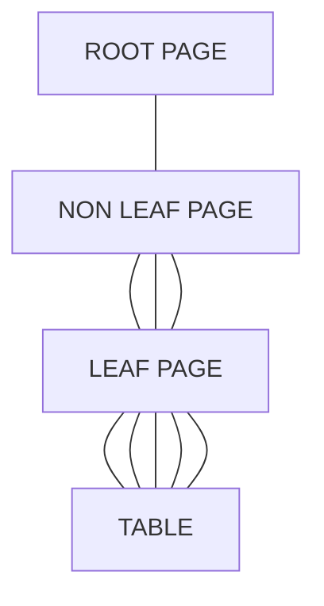

* @file cours2.md
* @author Rod Guillaume
* @date 12 Nov 2018
* @copyright 2018 Rod Guillaume
* @brief DB2 zOS, historique, Analytics

MainFrame est fait pour supporter des grosses charges et des environements
differents. (*Mixed Workload*).

# zMiddleWare (sous-systemes)

Les *Moniteurs transactionnels*:

Ca date des 60s. C'est fait pour gerer des transactions courtes. C'est pas fait
pour gerer de l'analytic, donc pas des requetes compliques.

WAS (je crois) c'est arrive pour rajouter une couche "Java" a IMS TM et CICS, vu
qu'ils ont ete cree avant son invention.

En plus y'a des *Gestionnaires de bases de donnees* (IMS DB, DB2), et un
*gestionnaire de message* (websphere MQ).

Tous ces trucs sont disponibles sur tous les OS.

# SGBD IBM zOS

* IMS/DB
  * Modele **hierarchique**
  * Extremement rapide pour des operations repetitives
* DB2
  * Modele relationnel

> Dans les grosses boites, souvent les deux types de DB se completent.
> hierarchique pour les petites donnees ou on a besoin de rapidite, et DB
> relationnelle quand y'a besoin de stocker bcp de donnnes

# Architecture zOS DB2

Acces a des donnees en meme temps, par des programmes batch, classiques,
Analytics...

Securite en terme d'acces (R,W,Update), de sauvegarde (restauration), integrite.

## Partitions, espace d'@

Comme a vu la semaine derniere, chaque middleware a son espace d'adresse, a sa
partiton.

On a donc par exemple:

* TSO (interface online)
* Batch
* DB2
* CICS
* IMS/TM

## @ space de DB2

* SSAS/MSTR
  * Cet espace est accede par:
    * moniteur transactionnel ou batch zOS
    * TSO
  * Il gere aussi les logs
* DBAS/DBM1
  * Gere toutes les DB de DB2 et gere aussi le catalogue de DB2 (les
    metadonnees)
* IRLM
  * gere les verrous
  * C'est a part, pour des raisons de stockage. A l'origine c'etait pas possible
    de le mettre dans DBM1 parce que les partitions ne faisaient que 2GB max.
    Donc valait mieux le mettre dans une partition a part.
* DDF/DIST
  * Arrive dans les annees 94-95.
  * Acces distribue
  * Acces non zOS (internet, pc...)

## Data sharing

Le *Sysplex*, c'est plusieurs systemes qu'on met l'un a cote de l'autre. 2 a 32
systemes mis ensemble.

Imaginons 3 machines. Elles peuvent etre distantes d'une dizaine de km avec la
fibre mais bon, faut pas trop les eloigner sinon ca flingue les perfs.

Chacune a son propre zOS, et chacune a son DB2.

Chaque DB2 va gerer ses informations, sa securite... MAIS les DB2 partagent les
memes donnees.

Chaque systeme a sa Log. Parce que ca fait vite des GB de log, et puis si y'a
un soucis tu peux lire le log de LA machine.

SysPlex Timer gere le temps pour que toutes les machines soient a la meme heure.

*Coupling Facility*, zone memoire qui permet de partager des infos entre les
differents DB2.

> Ex.
> Chaque DB2 a ses propres Buffer.
> Si y'a 2 DB2 qui veulent acceder a la meme donnees, la il va valoir qu'ils
> soient au courant que ces donnees sont en cours d'utilisation.
> Donc quand un DB2 fait un truc, il dit a la coupling facility de lock.
> Evidemment si c'est un lock de lecture, tu peux les faire lire en meme temps
> etc.

*Il n'y a pas de machine prioritaire par rapport a une autre! Pas de
maitre/esclave ou quoi!*

### Avantages

Si machine 1 tombe, toutes les applications sont alors dirigees vers la machine
2.

Equilibrage de la charge, si une machine est bcp sollicitee, on passe les
requetes sur un autre membre pour equilibrer la charge.

Niveau maintenance, on peut migrer d'une version a une autre sans arret des
systemes.

> On migre la machine 1, et on balance toute l'activite sur la machine 2.
> On remet tout sur la machine 1 et on migre la machine 2.

## Architecture distribuée

Avec le Data Sharing, on reste sur le Z.

L'architecture distribuée, c'est a partir d'applications *non Z* de pouvoir
acceder au Z via l'@ space.

DRDA = Distributed Relational Data Architecture

Protocole distribué DRDA.

Ce protocole est respecte par ttes les DB pour pouvoir communiquer entre elles.

Du coup on accede a la DB2 via DDF en utilisant le protocole DRDA.

## DB2 Web Service

DB2 n'execute pas de service web. Donc il faut un serveur chez IBM, qui execute
les requests chez DB2.

* Support de services web entrants
  * Servlet JEE, convertit demande WS en JDBC puis rendre le resultat en XML

Le serveur applicatif WAS il encapsule la requete SQL pour pouvoir ensuite la
renvoyer comme un service web.

Donc il recoit un `SELECT *`, il le fait, et renvoie le tout sous forme de
reponse de WS, donc du XML (c'est du soap apparemment, mais la semaine derniere
il a dit que c'etait du JSON maintenant pour des questions de tailles de
reponses).

Ah bah justement elle en parle. Donc avant c'etait du XML mais ils ont rajoute
l'acces REST/JSON, qui est plus leger pour les mobiles.

L'acces REST/JSON se situe maintenant directement dans le DDF.

> TODO verifier
Langage COBOL pour la DB ? Mais les autres langages sont acceptes aussi.

# Objets DB2

> On presente les objets par ordre de creation.

DB2 peut contenir plusieurs centaines, voire milliers de database.

* Storage group = disque ou sont contenues les donnees
* Table space
* Index space

Acces lecture uniquement en tant qu'administrateur.

Pour modifier les metadata (catalogue), ca se fait automatiquement par DB2 quand
on fait des operations speciales. (modification, creation d'objet...)

## Storage groups

Ensemble de volumes (disques) qui permettent de contenir les donnees.

Ils sont geres automatiquement par un gestionnaire de zOS (DFSMS), qui permet de
gerer l'emplacement des fichiers sur le disque, de gerer l'equilibrage sur les
disques pour eviter de bourrer un HDD et de laisser vide les autres.

A une epoque on pouvait dire qu'on voulait telle donnee a tel endroit mais ajd
ca a plus aucun sens, on laisse le DFSMS le gerer.

## Database

Objet logique. Pas de physique associe.

Une DB c'est juste une information dans le catalogue `SYSIDN, SYSDATABASE`.
Sur Windows apparemment ca creer carrement un espace disque et tout. La non.

C'est juste logique, pour separer les donnees.

> Genre le credit agricole qui a une DB par region vu que historiquement ce sont
> des caisses differentes.

## Databases systemes

* Catalogue c'est une DB Systeme.
* Directory
  * Quand on creer un objet DB2, il faut des blocs de controle, qui sont stockes
    dans cette db

* Catalogue c'est une DB Systeme.
* Directory
  * Quand on creer un objet DB2, il faut des blocs de controle, qui sont stockes
    dans cette db *directory*
* Work File Database
  * C'est pour les fichiers temporaires, quand on fait du travail sur la db.

En plus des DB systeme, on a des *User Database* qui sont la par defaut.
Si on precise rien, y'a une DB par defaut qui est creee.

Dans les systemes en *production*, cette table est cachee en general pour eviter
qu'elle finisse en DB fourre tout.

* User Default Database
  * Cachee en prod en general
* User Data Bases
  * Les DB de l'utilisateur, qu'on a cree.

## Table space

Au dela de la DB qui est un objet logique, on a un table space.

Conteneur de table. C'est une structure DB2 qui est passe dans un fichier zOS
(ou *page set*).

Y'a plusieurs types de fichier, donc le fichier sequentiel qu'on connait bien et
le fichier VSAM LDS (Linear Data Set).

Donc DB2 utilise ce vieux type de fichier VSAM, vu que ca existait deja avant et
par dessus il rajoute sa logique DB2.

Ces fichiers ce sont juste des enregistrements avec des donnees dedans qu'on
decoupe ensuite pour bien interpreter.

* Taille maximum = 16TB.

Ya plusieurs types de tablespace, selon ce dont on a besoin.

> Ce qu'on dit la, c'est juste pour Z. Les applications ne sont pas au courant
> de tout ca, pour eux c'est transparent.

Un tablespace c'est juste une page dans laquelle on rentre des lignes.

Types de tablespace:

* simple (obsolete, remplace par UTS)
* tablespace segmente
* tablespace partitionne
  * C'est evidemment transparent pour les applications !
  * contient une seule table avec des donenes reparties dans plusieurs
    partitions
  * Il faut un index pour savoir ou sont les index (l'index de partitionnement)
  * C'est utilise pour les grosses tables
  > Ca peut etre une question d'organisation = clients de la region 1, dans
  > partiton 1, etc.
  > Ca peut etre aussi de l'organisation = 12 partitions pour 12 mois. Et tous
  > les ans on fait une rotation et on ecrase les donnees apres.
  > Ca peut etre utile pour les lois qui t'obligent a garder tes donnees pendant
    5 ans etc.

Aujourd'hui, on est cense utiliser les tables suivantes:

* Universal Table Space = nouveau type de table space (depuis DB2 V9)
  * contient UNE seule table
* Partition By Range
  * Comme le TS partitionne.
  * Partition + grande
* Partition By Growth
  * C'est pour grandir au fur et a mesure, quand on connait pas au debut de
    combien on aura besoin.
  * L'inconvenient du partitionne, fallait savoir par avance cb de partition on
    aura, et faut des index.
  * Le PDG, il grossit quand il a besoin de creer une nouvelle partition
  * Pas besoin d'index et tout

Quand on creer un table space, on peut donner un espace libre initial. Ca permet
de faire des insertions sans desorganisation.

On peut aussi dire qu'on compresse les donnees etc pour gagner de l'espace.

## Tables

* Nom de colonne
* Types de colonne
* Caracteristiques de colonne
  * null, not null, not null with default

Une table a un proprietaire et a un nom unique dans DB2:
`nom_proprietaire.nomtable`.

Le nom du proprietaire est limite a 8 caracteres.

Ce qui est unique c'est pas le nom de la table, cest nomUser.tableName.

> Ex. de la table client
> 50 agences dans DB2.
> agence1.client, agence2.client, etc.

L'impact de cette limitation, c'est au niveau de l'acces aux tables.

`SELECT * FROM CLIENTS`

Quand on se connecte a DB2 on se connecte avec un userId. Par defaut ca utilise
ton userId.

Pour acceder aux autres, en etant connecte sous n'importe quel agenceN:
`SELECT * FROM agence2.clients`

En terme de jointure, on peut joindre toute table de DB2, peu importe dans
quelle database elle est situee.

Y'a pas de `connect to database`. On se connecte a l'ensemble du DB2
(implicitement). Et dans DB2, on peut acceder a n'importe quelle table de
n'importe quelle db.

Sur UNIX ou Windows, une database = un systeme.
En DB2 Z, c'est la DB2 qui est le systeme.

## Creation Table

Du coup quand on fait:
```sql
CREATE TABLE EMPLOYEE -- implicitement c'est dans ton userId.
(...)
IN GROUPSTORAGE; -- tu dis dans quel group c'est.
```

## Tables avec integrite referentielle

L'integrite referentelle (contraintes referentelles sur les cles
primaires/secondaires qui vont bien, pas null, unique...) peut etre gere par DB2
ou par l'application.

## Index

Y'a des index pour respecter l'integrite ou pour des soucis de perfs.

Ils sont stockes dans un IndexSpace, qui est cree implicitement a la creation
d'une table.

Types d'index:

* Unique (cle unique)
* non unique
* Cluster
  * 1 seul par table, quasiment dans toutes les tables.
  * Il impose dans la mesure du possible le tri physique de l'ensemble des
    donnees.
  * Y'en a donc UN vu qu'on peut trier que sur un critere
  * Tres souvent on trie sur la cle primaire
  * C'est utile quand on fait un traitement de type batch, je retrouve mes
    donnees triees physiquement dans l'ordre dans lequel je m'attends
* Index de partitionnement
  * Gere la cle de repartition sur les partitions
* Index partitionné
  * physiquement on est partitionné

## Structure d'un index



Dans les *leaf pages* on trouve le pointeur sur la ligne (numero dans la page,
puis adresse dans la page).

Les *non leaf page* c'est pour la dichotomie. C'est un arbre en fait...

Pour rester trier, avec le cluster, il nous faut des trous dans les pages. D'ou
l'interet du PCTFree, qui force d'avoir X% de vide dans les pages.

## Index partitionné VS index partitionnement

* partitionnement = physiquement partitionné

* partitionné = on creer un autre index, qui est secondaire. Lui est trie, mais
  physiquement c'est pas le cas
  * comme ca pour les applications c'est transparent

## Creation index

```sql
CREATE INDEX ...
ON TABLENAME
...
Caracteristiques -- ERASE NO, BUFFERPOOL ...
...
FREEPAGE 0
PCTFREE 10
...
COPY YES
PARTITIONNED; -- physiquement partitionné
```

`ERASE YES` c'est pour ecraser les donnes par des 0 quand on supprime un index,
une table etc. Donc pour des questions de securite on le fait parfois.

## Table virtuelle (les vues)

Bon tu connais je te fais pas une explication.
C'est une "table" qui est un SELECT en realite. C'est du calculé ou un sous
ensemble.

## MQT Materialized Query Tables

Une MQT c'est comme une vue mais dont les donnees existent vraiment. C'est pas
du calculé.

Donc genre si c'est une vue qui est juste une jointure, bah la table est
vraiment creee et on la recupere direct sans requete.

Par contre quand on met a jour les tables dont elle est issue bah elle est
obsolete. Donc c'est plutot utilise dans des env ou y'a peu de mises a jour des
tables.

## Sequences

pareil tu connais.

Avant y'en avait pas et c'etait le bordel, c'etait dans une table d'index qui
etait sollicitee H24 donc c'etait grave lent.

## Trigger

Arrives tard chez DB2. Ils sont assez peu utilisés chez les clients d'IBM du
coup.

## Modification/Suppression

* `ALTER`
  * ajout colonne a une table
  * modif Caracteristiques
  * changer de type de tablespace
  * ...

* `DROP`
  * si on supprime une table ou une db, ca fait effet cascade !!

# LOBs (Large Objects)

Ca permet d'integrer image ou voix dans DB2

* BLOB pour Binary Large Obj
* CLOB Character Large Obj
* DBCLOB Double Byte CHaracter Large Object (pour les langues asiatiques, car
  ils ont enormement de caracteres)

> Ex. ajouter une photo de l'employe -> BLOB
> Ex. ajouter cv employe -> CLOB

Comme ce sont des objets de grandes tailles, on aura plutot une table auxiliaire
qui va contenir les LOB et dans les tables on aura un pointeur vers les tables
de LOB.

Un tablespace LOB peut conenir une seule table auxiliaire.
Une table aux se compose d'1 seule colonne.

> Ex. images cheques dans les banques
> Ex. conservation des contrats d'assurance
> Ex. conservation photos des sinistres

## XML, JSON

* support du XML comme type de donnees aussi, avec comme type `XML`
* support du JSON mais c'est stocke en tant que BLOB.
  * C'est stocke comme du Binary JSON.

# Programmes avec DB2

On ecrit avec des delimiteurs les operations SQL DB2:

```C
EXEC SQL
SELECT * FROM truc
WHERE machin = bidule; -- en COBOL: END-EXEC
```

Ensuie y'a une precompilation qui commente les SQL, et fout les SQL dans un
module a part puis fait un binding entre les deux.

On a donc un *bind package* et ce bind package c'est les requetes SQL +
verification syntax SQL et verification droits et aussi il verifie que ce qu'on
demande pour peut etre ameliorer le chemin d'acces des donnees.

On a donc des modules (les programmes) et des packages (SQL).

# Utilitaires

> Bon apres elle parle des utilitaires. Regarde les slides.

## Recover

Dans le catalogue y'a les infos de la COPY_FULL, de la COPY_INCR (incrementale),
et quand on recover il trouve tout seul ou aller chercher les sauvegardes.

Incrementale c'est juste une sauvegarde partielle, comme Docker quoi. T'as une
image et les petits modifs.

Dans le cas d'un *job batch*, on peut restaurer jusqu'au dernier point de log et
des sauvegardes intermediaires.


Qunad on fait des `recover` on peut `recover to copy` ou `recover to rba` si on
est dans le cas d'un batch et qu'on veut revenir a un log specifique.

Quand on recover, faut faire attention a recreer les index aussi, sinon ca pete
l'integrite.

# Sécurité

## Les droits

> cf. slides

## Chiffrement

Chiffrement hardware. independant de DB2.
Chiffre quand ca arrive, et dechiffre quand ca arrive a l'utilisateur.

Chiffrement logiciel. C'est plus fin, mais ca securise moins.

Ca oblige aux applications de demander le mot de passe quand l'utilisateur entre
ou recoit des donnees.

# Optimiseur

Fonction optimiseur dans DB2, c'est elle qui choisit le bon chemin d'acces
(appelée au moment du bind/rebind).

Il utilise donc l'ordre SQL, les index, la volumetrie, etc. donc il utilise
`runstats` evidemment.

## Chemins d'acces possible

* Tablespace Scan
  * chemin si on doit acceder a toutes les donnees de la table
* Index Scan
  * Utilise si y'a un predicat portant sur une colonne indexee
  * On accede par l'index
* d'autres chemins plus complexes sont utilises en particulier pour les
  jointures
* Si c'est partitionne on peut meme faire du parallelisme

## Visualisation des chemins

`EXPLAIN YES` ca permet de voir le chemin d'acces.
