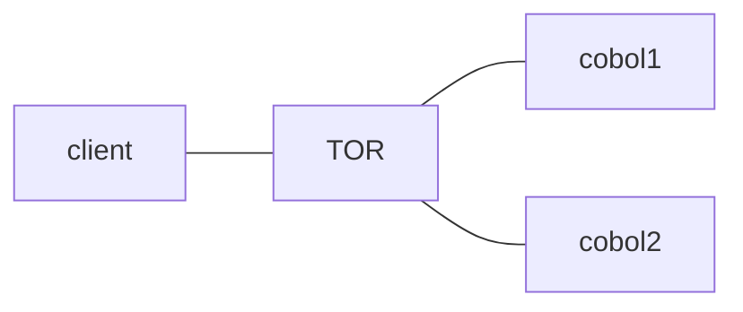

* @file cours4.md
* @author Rod Guillaume
* @date 26 Nov 2018
* @copyright 2018 Rod Guillaume
* @brief Transformation numerique avec la plateforme zOS

> Comment on est passé de l'existant à un monde numérique?
Comment on est passé des visites à la banque à la gestion par Internet?

# Transactional System

> Ex. scenario appel d'offre de la FNAC
> Elle veut un site pour faire des achats, donner des avis, solliciter des conseillers, payer, securiser...

Avant c'etait des outils via terminal.

Ensuite dans les 2000s on est passe a des app web, accessibles depuis n'importe
quel pc.

Ensuite c'est passe aux sites qu'on connait ajd, avec les images des produits et tout.

*Traitement Batch*: Meme traitement sur un gros set de donnees.
Traitement automatique, sans besoin d'un utililisateur pour lancer le truc.
> Ex. facture

*Transaction*: dialogue avec la DB. Bon tu connais. Apparemment au quizz ca va
parler de ca. Unitaire.
> Si ca passe bien, commit, sinon rollback.

batch = programme pour etre automatiquement lance a une heure, sans besoin d'un user.
Resultat non immediat. Ca tourne tout seul et l'output sort plus tard.

*Online **Transaction** Processing*: lance par un *end user*. Input donne par le
end user pour une seule requete. Output immediat.

# Transaction

Quand on communique avec une app, c'est une transaction.

*commit*, *rollback*.

*Multitasking*: plusieurs users consultent ton site/webapp etc.

*Reentrance*: Enter/Exit = se souvenir du contexte quand l'user part sur un
autre site puis revient (genre il va payer sur Paypal)

**PARTIEL** bien apprendre la slide **Business Application Requirements**.

**Transactional Monitor** bien apprendre les specificites sur les slides pour le
**PARTIEL**.

Ca existe depuis 50 ans apparement son monitor.

Dans le web, on trouve *Wordpress*, *Tomcat*, *JBoss*.

Sur le Z, y'a deux moniteurs transactionnels: *IMS* et *CICS*. Ces deux la ont
les proprietes ecrits sur les slides.
Y'a 50 ans les apps ont ete ecrites en COBOL.

CICS c'est les anglais.
Les americains ont cree IMS.

Les anglais ont ete plus creatifs. Ils ont essaye d'etendre le moniteur
transactionnel et ca fait des transactions tres courtes.
IMS gere plutot des gros volumes de client.

# Zoom sur CICS (Customer Information and Control System)

Il est multiplateforme. Il gere le COBOL et le Java.

Pour le **PARTIEL** apprend bien la signification de CICS !

**EGUI**, c'est le code qui permet de lancer l'app de monitoring transactionnel.

# WebSphere Application Server (WAS)

Java arrive avec ses applications qui tournent partout. (Write once, run
everywhere)

Arrivee des serveurs d'application.

> JBoss, Tomcat, Jeti, ... et **WebSphere Application Server** d'IBM

**WLM** gere tout seul les ressources dans les WAS. Quand y'a besoin de plus de
ressources il prend de nouveaux *servants*.

Une WAS ca doit avoir:

1. **Colo-Location** (JDBC, etc.)
2. **Securite** RACF,
3. **Haute dispo** WLM

# Recap matin

2 types app: Batch ou Transaction (TP ou OTP online transaction processing)

Batch = asynchrone, programmé pour être lancé automatiquement
TP = synchrone, end user qui lance

Le Moniteur Transactionnel gere un TP (un serveur).
Il fait tourner ton TP.

WAS = Java
IMS = COBOL
CICS = COBOL ou JAVA

# JDBC

JDBC de type 4 = 2 machines differentes pour server et DB
JDBC type 2 = DB et server app sur la meme machine.

# Message Management (IBM MQ Series)

Deux types de messages: synchrone et asynchrone.

> Ex. asynchrone = mail.
> On attend pas la reponse quand on envoie un mail

IBM MQ, ca marche sur tous les OS.

Pour lire et envoyer des messages, on peut utiliser C/C++, COBOL, Fortran, PL/I, Java/JMS, etc.

Protocole JMS c'est pour envoyer des messages IBM MQ sur Java.
Comme JDBC pour DB2.

**Pub/Sub**: Publisher, Subscribers
C'est ce principe pour MQ apparemment.

> Analogie avec Twitter. T'as un mec qui publish et t'as des subscribers.

> Bon apres il nous parle de son CICS, ses WAS, qui se sont ouvert a Internet avec les API SOAP puis JSON en 2010s.

Donc pour resumer:

3 types de server d'app: IMS, CICS, WAS
Ensuite on peut ouvrir le mainframe via JSON et SOAP.

Le server qui assure les connexion avec SOAP et JSON c'est z/OS Connect EE.

# PARTIEL

----

**Architecture standard** (slide avec le mainframe, la DB a droite, et un truc a gauche.)

Nommer les 5 elements du schema.

---

Moniteur transactionnel, nommer les fonctionnalites.

---

Definition CICS

C'est quoi un WAS?

Specificite d'un batch? (output delayed, scheduled etc)

Citer 2 moniteurs transactionnels (IMS, CICS)

CICS supporte le Java? V/F

QU'est ce qui assure la haute disponiblite d'un...

Qu'est ce qu'apporte WAS par rapport aux autres?

Quand on accede a un server qui est sur la meme machine qui est sur la machine, on accede a quel JDBC? Type 4, Type 2 ?

JMS permet de gerer les requetes de type...?

Definition de CTG en CICS?

IBM MQ c'est quoi?

JMS permet de gerer les messages synchrones uniquement? V/F

Quel service de zOS permet de diriger les flux de transaciton vers le serveur le plus a meme de repondre

Que signifie JSON?

Quelles sont les proprietes d'un JSON?
> structure simple, ne necessite pas de parser, ne supporte pas le JS?

Signification WSDL?

CICS permet d'exposer un programme comme un WS SOAP ou REST/JSON ? (faut choisir
les phrases vraies)

zOS connect permet d'acceder aux apps CICS via les interfaces de types?
JSON, SOAP...?

Donner les specificites de Batch?

Donner des fonctionnalites qu'un moniteur transactionnel apporte?

Over 30 billion transactions CICS processed per day?

L'attente sur une operation I/O est de la responsabilite des apps CICS?

CTG permet d'executer des request SQL depuis un programme CICS?

WAS se base sur le composant suivant pour assurer la haute disponiblite? (liste
de reponse)

TOR c'est le composant qui s'occupe de dispatcher dans WLM. On l'a vu plus haut.

Que supporte CICS?

Quel est le nom du conncteur fourni par CICS qui permet l'acces a un sous programme CICS a partir de .NET

JMS definition?

CICS par rapport a IMS?

Quel est le service qui s'ccoupe du dispatch ? WLM

Declinez le support de XML dans CICS (expliquer le fonctionnement du support XML
dans CICS)
> En gros ca recoit du XML, ca transforme en COBOL, puis ca transforme le COBOL en XML.
